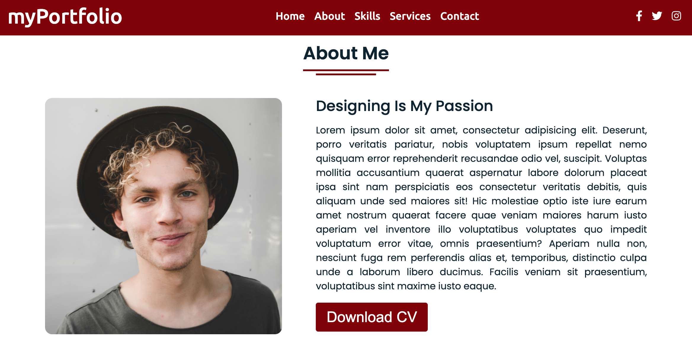

Don't forget to hit the :star: if you like this repo.

# Lab 1: Fluid Grid Exercise

The goal of this exercise use the [responsive grids classes](https://getbootstrap.com/docs/5.2/layout/grid/) from [Twitter Bootstrap](https://getbootstrap.com/docs/5.2/getting-started/introduction/) to lay out a columnar website that fluidly resizes based on screen resolution

- Start with the starter code file [`grid_starter.html`](download/grid_starter.html) and css [`grid.css`](download/grid.css) by right-clicking and saving the file it to your computer.
- Use the [Bootstrap grids classes](https://getbootstrap.com/docs/5.2/layout/grid/) to make the content a fluid layout according to the following:

Bonus: Add images, using the [card group](http://v4-alpha.getbootstrap.com/components/card/) class to organize the content.

Play around with changing the styling (fonts, colors) by editing grid.css.

Or play around with adding more components!

<button class="btn" onclick="showSolution();">Show Solution</button>

    <a href='/bootstrap-hosting-github/exercises/grid/grid_solution' target='_blank'>View Solution in New Window</a>

> File 📁 : [lab1.zip](./download/lab1.zip?raw=true)
> 
> Activity 🏆 :
> This exercise makes use of three files: HTML, CSS, and JavaScript. Please see Figures 1.1–1.6 for the Lab 1 interface. You must spend 10-15 minutes with a team member in this exercise lab. Please debate and research the following:
> - How to create this website?
> - Would you be able to complete it if you were given the task of creating a website like this?
> - What steps are needed to create this website?
> - Which part is difficult to understand and produce?
> - Provide an overall summary of the website's creation.
> 

**Figure 1.1**: Mainpage

**Figure 1.2**: Interface 2

**Figure 1.3**: Interface 3

**Figure 1.4**: Interface 4

**Figure 1.5**: Interface 5

**Figure 1.6**: Interface 6

## Contribution 🛠️
Please create an [Issue](https://github.com/drshahizan/learn-php/issues) for any improvements, suggestions or errors in the content.

You can also contact me using [Linkedin](https://www.linkedin.com/in/drshahizan/) for any other queries or feedback.

