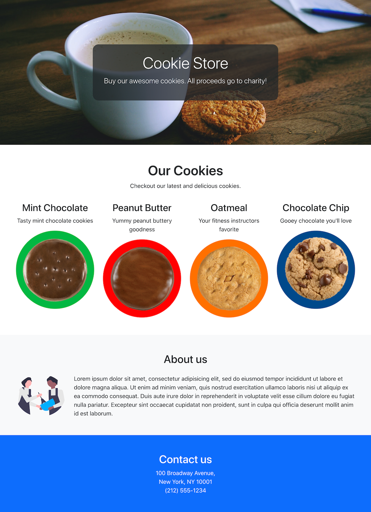

# Bootstrap 5.2 Lab

## Build a responsive cookie store web page

In this lab, you are given an [index.html](index.html) file that contains our web page's content, and we will be using Bootstrap to build a responsive layout and style the page.

> NOTE 1: the goal of this lab is familiarity with bootstrap and grid systems. Your page does NOT have to be a pixel-perfect recreation of the screenshots provided. Feel free to use your own creativity for colors, fonts, and other undefined parts of the assignment.

> NOTE 2: You can add additional `
` tags and other tags as necessary, but don't change the order of the original content tags. Reordering those tags would impact the accessibility of the content.

## Part 1. Add Bootstrap

1. Fork this repository
2. Clone your fork of the project
3. Open the [index.html](index.html) file in your code editor
4. Open the [index.html](index.html) file in your web browser
5. Link the `css/styles.css` file in the `<head>` section of index.html
   - _We will use this css file to add our own custom styles_
6. Link the Bootstrap CSS file in the `<head>` section of index.html
   - Use the [CDN link tag](https://getbootstrap.com/docs/5.2/getting-started/introduction/#quick-start)
7. Reload index.html in your web browser

> After reloading the page you should notice subtle changes to the page like a different font, margins, and spacing on the page. This lets us know that Bootstrap was added properly.

## Part 2. Responsive layouts

1. Apply the [bootstrap grid classes](https://getbootstrap.com/docs/5.2/layout/grid/) to the cookies on the page in the `<main>` section. The resulting responsive layout should display as follows:

   - On [mobile screens](screenshots/index-mobile-screen.png), 1 cookie per row
   - Starting on [medium `md` screens](screenshots/index-md-screen.png), 2 cookies per row
   - Starting on [large `lg` screens](screenshots/index-lg-screen.png), 4 cookies per row
   - Read about making your [images responsive](https://getbootstrap.com/docs/5.2/content/images/)

2. Apply styling and classes so that the title text is displayed centered within the `<header>` section. Below are some hints on how to do this:

   - Use custom styles for this section
   - Give the header section a fixed height, I used 400px
   - Read about using images with a `cover` [background-size](https://developer.mozilla.org/en-US/docs/Web/CSS/background-size)
   - Read about how to center a div block
   - Choose a background image of your own or use [the image provided](images/coffee-biscuits.jpg)
   - There are multiple ways to solve this section

3. Style the "About us" section and the `<footer>` section of the page to display similar to the [screenshots](screenshots/index-lg-screen.png)

   - Use a grid for the "About us" section
   - style the footer as you like

## Part 3. Reordering grid columns visually

1. Open the [alternating.html](alternating.html) page in your code editor
2. Open the [alternating.html](alternating.html) page in your web browser
3. Using only bootstrap grid styles make the cookie products alternate as shown and described in the following screenshots:

   - On [mobile screens](screenshots/alternating-mobile-screen.png), display 1 cookie per row
   - Starting on [medium `md` screens](screenshots/alternating-md-screen.png), display the cookie image and details on the same row, but alternate the order of these two on every row
   - Read about [reordering columns](https://getbootstrap.com/docs/5.2/layout/columns/#reordering) and [offsetting columns](https://getbootstrap.com/docs/5.2/layout/columns/#offsetting-columns) in the bootstrap documentation

> IMPORTANT:
>
> - _Don't_ change the order of the 3 main cookie html tags, the `<h3>`, followed by the `
`, and then the `` tags. _Remember, we want to keep semantic order._
> - You can add `
`'s and bootstrap classes as needed, you can wrap the tags in div's as needed, as long as you don't change the order.

## Submitting your work

- Add and commit your code to your forked repo
- Make a pull request back to this repo
- Fill out the template repo noting which class section you're in

## Additional Resources

- [Bootstrap 5.2 Examples](https://getbootstrap.com/docs/5.2/examples/)
- [How to add different fonts to your web page](https://developer.mozilla.org/en-US/docs/Learn/CSS/Styling_text/Web_fonts#using_an_online_font_service)
  - [Google Fonts](https://fonts.google.com/) offers free fonts

## Credits

- Coffee mug and biscuit photo by <a href="https://unsplash.com/es/@epicantus?utm_source=unsplash&utm_medium=referral&utm_content=creditCopyText">Daria Nepriakhina 🇺🇦</a> on <a href="https://unsplash.com/s/photos/coffee-and-cookies?utm_source=unsplash&utm_medium=referral&utm_content=creditCopyText">Unsplash</a>
- Bakers illustration from https://undraw.co/illustrations
- Cookie images from https://www.girlscouts.org/
