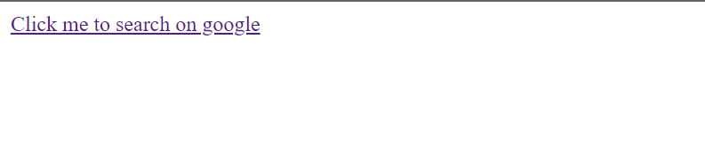

# `05` Create anchors 

En esta lección, empezaremos a usar los atributos de las etiquetas. Los atributos permiten dar información adicional sobre los elementos de HTML.

Algunos de los atributos que vas a usar frecuentemente son: `href`, `src`, `placeholder`, y muchos más.

## 📝 Instrucciones:

1. Agrega al `<body>` del sitio web un anchor `<a>` (link) tag que diga: `"Click me to search on google"`

2. El link del anchor `<a>` debe llevar al usuario a la url [https://google.com](https://google.com) cuando haga clic (usa el atributo `href`).

## 💻 Resultado Esperado:



## 💡 Pistas:

+ Tu código debería de ser algo así:

```md
<a href="url">--Tu texto--</a>
```

+ Lee sobre la propiedad `href`: [https://www.w3schools.com/tags/att_a_href.asp](https://www.w3schools.com/tags/att_a_href.asp)

+ Lee sobre rutas absolutas vs relativas aquí: [http://www.coffeecup.com/help/articles/absolute-vs-relative-pathslinks/](http://www.coffeecup.com/help/articles/absolute-vs-relative-pathslinks/)


## 🔎 Importante:

+ La `url` dada es una ruta ABSOLUTA porque comienza con "http", eso significa que le está diciendo al navegador que va a llevar al usuario FUERA de tu sitio web.
