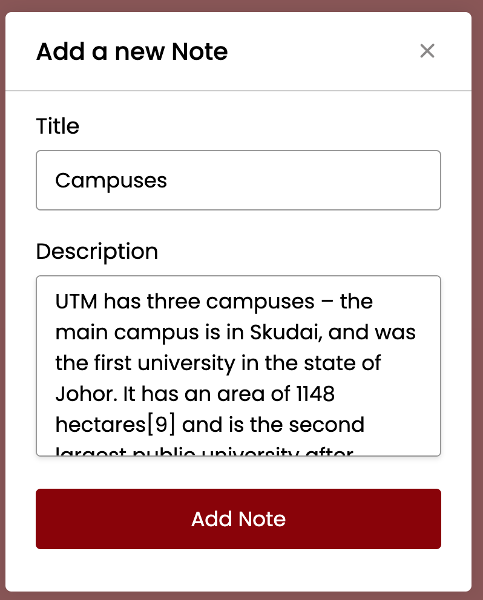
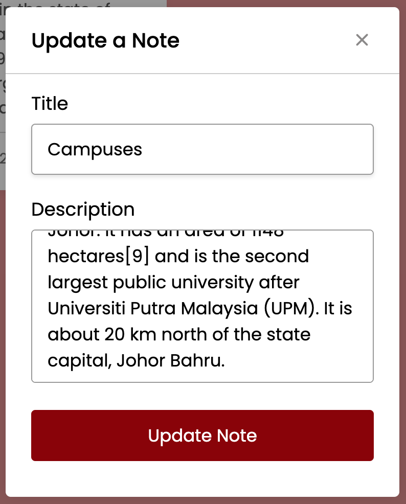

Don't forget to hit the :star: if you like this repo.

# Lab 1: A Notes App

Users can easily add, edit, and delete notes in this note app. The notes that the user has added to this app will be saved in the browser's local storage and will not be removed on page refresh or tab close, and this is done entirely with JavaScript.

You will learn about JavaScript array methods, Event listeners, and local storage, and you will use these concepts to build simple projects.

> File 📁 : [1 Notes App](./download/1Notes%20App)
> 
> Activity 🏆 :
> - For this application, you must create a flowchart.
> - State the javascript technology you have learned.
> - Give a brief description of each function that was used.
> - Where is the data kept? How is it kept?

**Figure 1.1**: Mainpage

**Figure 1.2**: Add new note

**Figure 1.3**: Add Note

**Figure 1.4**: Edit & Delete

**Figure 1.5**: Update a note

## Contribution 🛠️
Please create an [Issue](https://github.com/drshahizan/learn-php/issues) for any improvements, suggestions or errors in the content.

You can also contact me using [Linkedin](https://www.linkedin.com/in/drshahizan/) for any other queries or feedback.

