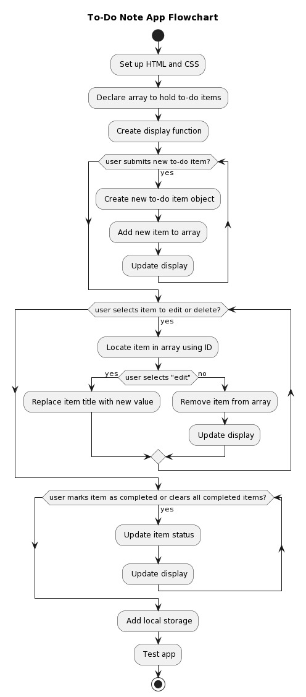

# Lab 1: A Notes App

Group:
1. Name: SHARVIN A/L M.GUNALAN,          Matrix No: SX221955ECJHF04 , Github ID: Sharvin01
2. Name: SUBAHSHINI A/P SANGARA LINGAM,  Matrix No: SX220328ECJHS04 , Github ID: Subahshini15
3. Name: MUHAMMAD FAIZAL BIN ASARAB ALI, Matrix No: SX221609ECJHF04 , Github ID: Faizal994
4. Name: MOGANAKUMARAN A/L SELVAKUMARAN, Matrix No: SX211706ECRHF04 , Github ID: RN1310

Activity 🏆 :
## Q1: For this application, you must create a flowchart.
Ans:

**Figure 1**: Flowchart for the application.

Q2: State the javascript technology you have learned.

DOM manipulation:
The code utilizes various methods and properties to manipulate the Document Object Model (DOM) elements, such as querySelector(), querySelectorAll(), insertAdjacentHTML(), innerText, value, classList, remove(), addEventListener(), and removeEventListener().

Event handling:
The code demonstrates effective event handling techniques to respond to user interactions, including click events, focus events, and key events.

HTML and CSS manipulation:
The code dynamically manipulates the HTML and CSS styles of the DOM elements using the style property, CSS classes, and the classList property.

Q3: Give a brief description of each function that was used.
Answer:
Brief description of each function used in the code:

addBox.addEventListener("click", ...): This function adds an event listener to the addBox element. When the element is clicked, it triggers a callback function that sets the title and button text in the popup box and displays it. It also focuses on the titleTag input field under certain conditions.

closeIcon.addEventListener("click", ...): This function adds an event listener to the closeIcon element. When the element is clicked, it triggers a callback function that resets the state by clearing the input fields, hiding the popup box, and enabling scrolling.

showNotes(): This function is responsible for displaying the existing notes. It removes any existing note elements, iterates over the notes array, and dynamically creates HTML markup for each note. The generated markup is then inserted into the document.

showMenu(elem): This function is used to display the menu options for a note. It adds a CSS class to the parent element of the menu icon (elem) to show the menu. It also attaches a click event listener to the document object to hide the menu if a click occurs outside the menu or on a different menu icon.

Q4: Where is the data kept? How is it kept?
Answer:
The data in this code is stored using the browser's local storage feature, accessible through the localStorage API. Local storage provides a means for web applications to store data in key-value pairs.

In this code, the notes array is stored and retrieved from local storage using the localStorage.getItem() and localStorage.setItem() methods. The data is serialized to JSON format using JSON.stringify() before being stored and deserialized using JSON.parse() when retrieved.

During page load, the code attempts to retrieve the "notes" data from local storage using localStorage.getItem("notes"). If data exists, it is parsed using JSON.parse() to convert it into a JavaScript array. If no data is found, an empty array is assigned to notes.

When a note is added, updated, or deleted, the notes array is modified accordingly. The updated notes array is then stored back in local storage using localStorage.setItem("notes", JSON.stringify(notes)). This ensures the data is persisted between page reloads and browser sessions.

