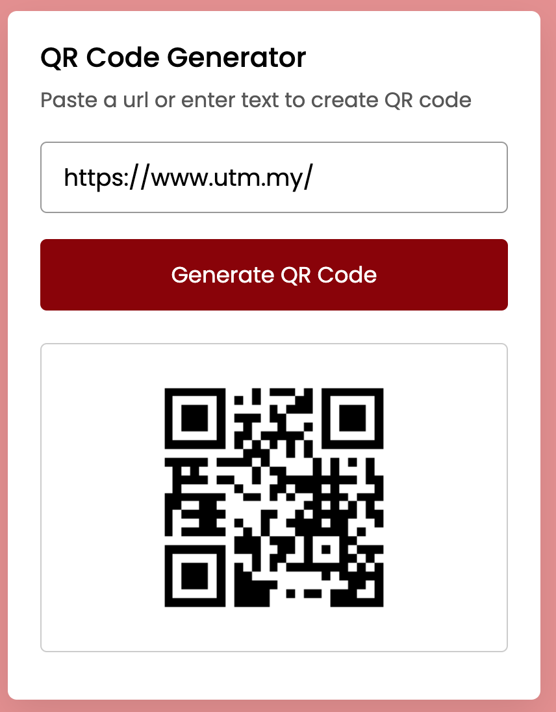

Don't forget to hit the :star: if you like this repo.

# Lab 10: QR Code Generator 

QR (Quick Response) codes can store a large amount of data, and users can easily access it by scanning the QR code. Users can enter a text or URL into my QR Code Generator app to generate a QR code for it. It is a QR code generator app, not a scanner app. The qrserver API was used to generate a QR code from user inputs.

> File 📁 : [10 QR Code Generator](./download/10%20QR%20Code%20Generator)
> 
> Activity 🏆 :
> - How are QR codes generated?
> - QR should be resized to 300x300.
> - What data is sent to the Api Server?
> - What is the function of a wrapper?
>

**Figure 10.1**: Insert url example https://www.utm.my/

**Figure 10.2**: click Generate QR Code

## Contribution 🛠️
Please create an [Issue](https://github.com/drshahizan/learn-php/issues) for any improvements, suggestions or errors in the content.

You can also contact me using [Linkedin](https://www.linkedin.com/in/drshahizan/) for any other queries or feedback.

