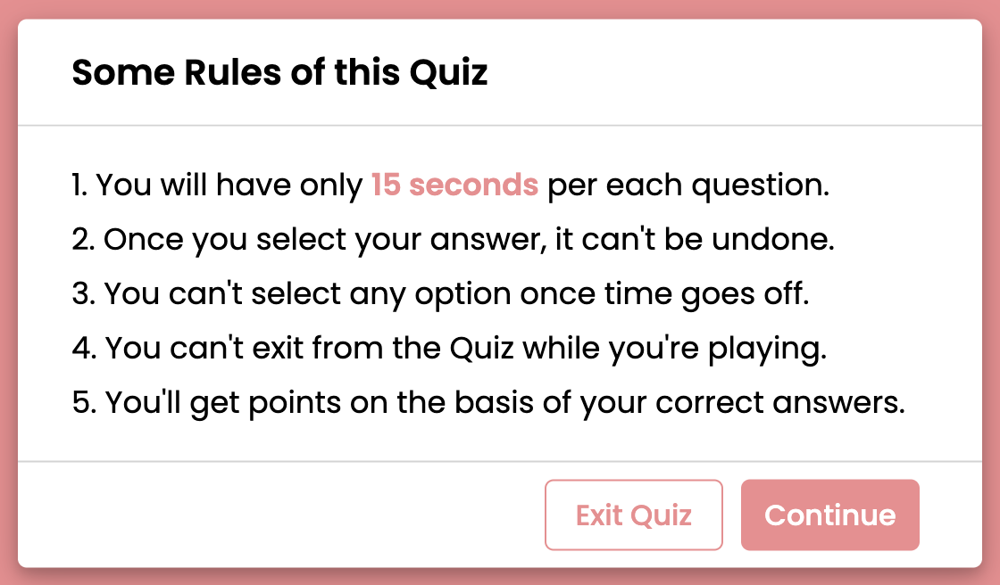
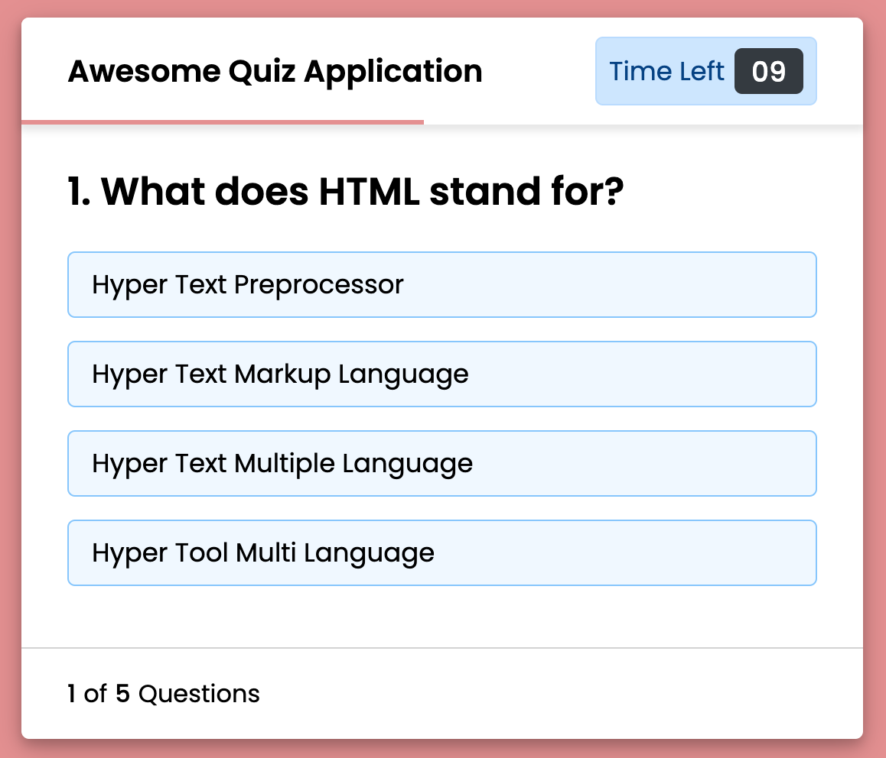
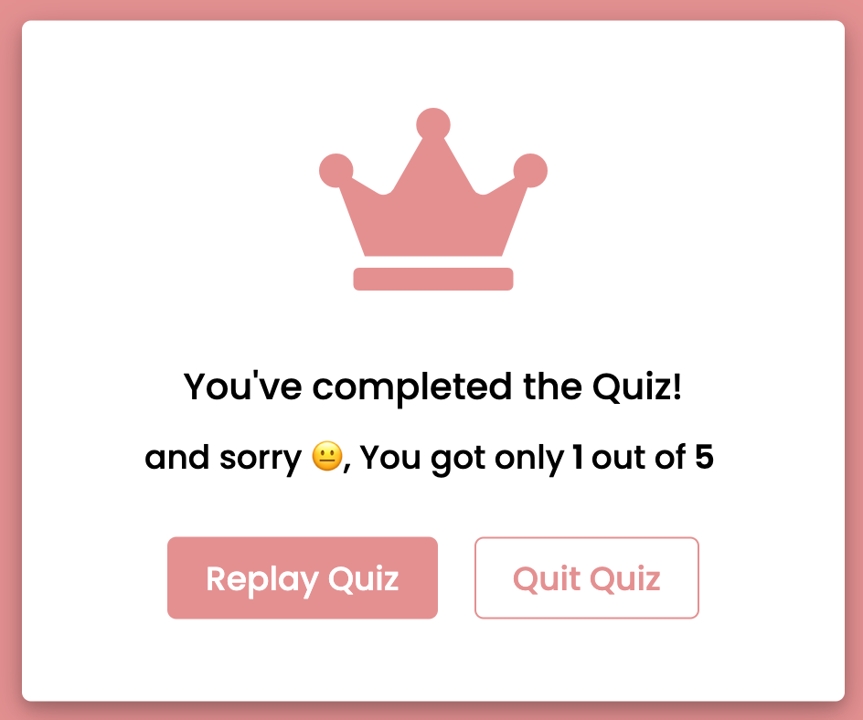

Don't forget to hit the :star: if you like this repo.

# Lab 11: A Quiz App with Timer

This programme has three layers or boxes, which are displayed one by one when a specific button is pressed. On the webpage, there is a button labelled "Start Quiz," and when you click on that button, an info box with popup animation appears.

There are some quiz rules and two buttons labelled "Exit" and "Continue" in this infobox. When you click the Exit button, the information box is hidden, but when you click the Continue button, the Quiz Box appears.

There is a header with a title on the left side of the Quiz Box and a timer box on the right side. This timer decrements from 15 to 0 seconds, and there is also a timeline indicator that slides from left to right according to the timer. If the user chooses a time between 15 and 0 seconds, the timer is stopped and all available options are disabled.

If the user selected option is correct, the selected option colour, background colour, and tick icon are all changed to green to notify the user that the selected answer is correct. If the user selects an incorrect option, the selected option's colour, background colour, and the cross icon change to alert the user that the selected option is incorrect, and the correct option is automatically selected.

If the user does not select an option between 15 and 0 seconds, the timer will stop when it reaches 0 and the correct answer to that question will be selected automatically. Following that, there is a next button that displays the next question, and this Quiz has a total of five questions.

Finally, the result box will appear, displaying the user's score as well as two buttons [Replay Quiz, Quit Quiz]. If the user clicks on the replay quiz button, the quiz will restart with the first question and the user's score will be 0, but if the user clicks on the quit quiz button, the current window will be reloaded and the quiz will begin from the beginning.

> File 📁 : [11 Quiz](./download/11%20Quiz)
> 
> Activity 🏆 :
> - What are the functions of question.js and script.js?
> - Try adding quiz questions to the list of ten questions.
> - How to change Response Time to 30 Seconds.
> - Where are the scores saved?
> - What happens when you click the Quiz replay button?
> - What are the css/all.min.css files for?
> 

**Figure 11.1**: Start quiz

**Figure 11.2**: Rules if this quiz

**Figure 11.3**:  Question 1

**Figure 11.4**: Answer Question 1

**Figure 11.5**:  Question 2

**Figure 11.6**:  Finish quiz

## Contribution 🛠️
Please create an [Issue](https://github.com/drshahizan/learn-php/issues) for any improvements, suggestions or errors in the content.

You can also contact me using [Linkedin](https://www.linkedin.com/in/drshahizan/) for any other queries or feedback.

