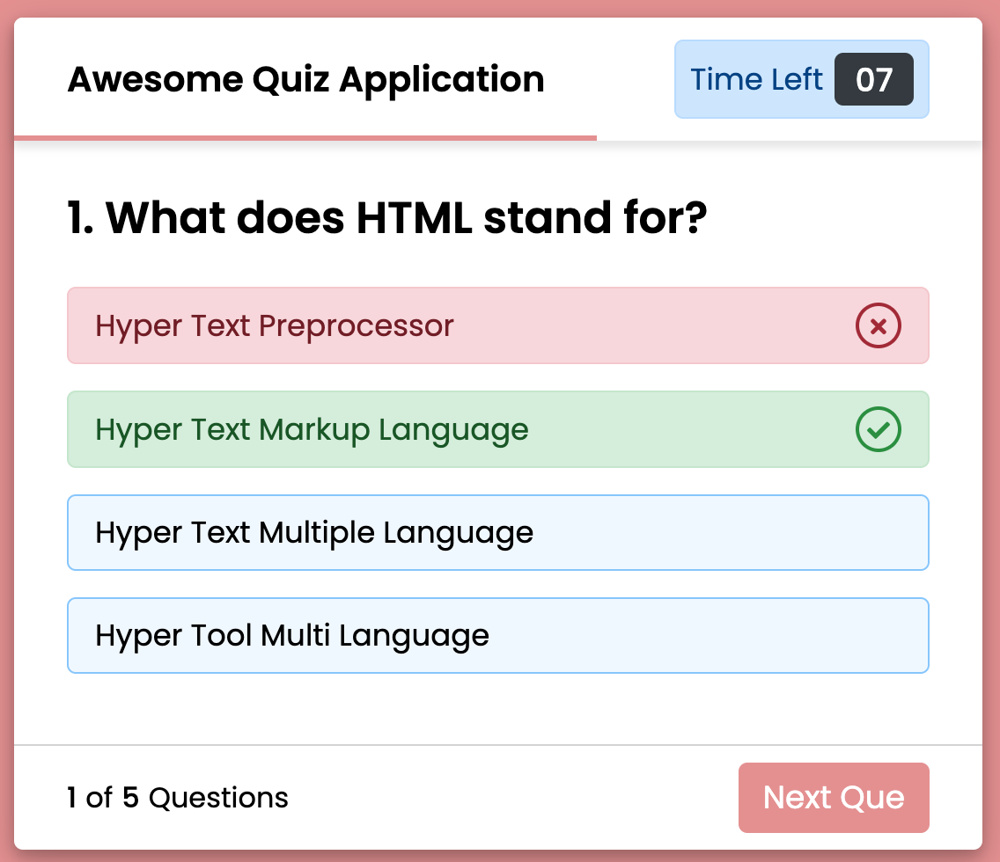
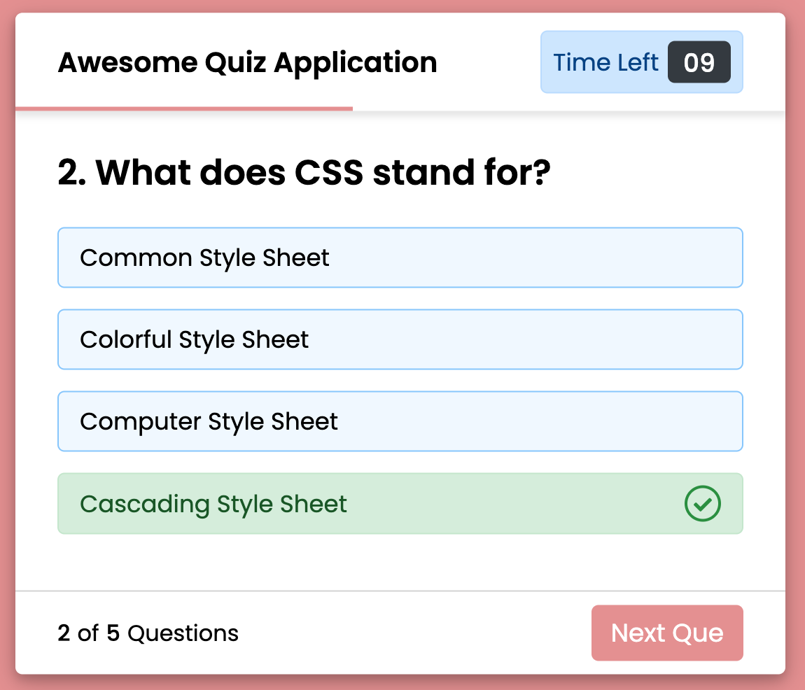

<a href="https://github.com/drshahizan/learn-php/stargazers"></a>
<a href="https://github.com/drshahizan/learn-php/network/members"></a>
<a href="https://github.com/drshahizan/learn-php/pulls"></a>
<a href="https://github.com/drshahizan/learn-php/issues"></a>
<a href="https://github.com/drshahizan/learn-php/graphs/contributors"></a>


Don't forget to hit the :star: if you like this repo.

# Lab 12: Sidebar Menu Templates


> File 📁 : [12 Sidebar](./download/12%20Sidebar)
> 
> Activity 🏆 :
> - What are the functions of question.js and script.js?
> - Try adding quiz questions to the list of ten questions.
> - How to change Response Time to 30 Seconds.
> - Where are the scores saved?
> - What happens when you click the Quiz replay button?
> - What are the css/all.min.css files for?
> 

A sidebar menu is a commonly used user interface element in web design. It is a vertical navigation menu that appears on the left or right side of a web page and typically displays links to various sections of a website. 

Sidebar menu templates in HTML, CSS, and JavaScript are pre-designed code snippets that developers can use to quickly and easily create a sidebar menu on their web pages. These templates often include styles for basic functionality such as hover effects, active states, and responsive design for mobile devices. 

Some common features and techniques used in creating sidebar menu templates:

1. HTML Markup: The HTML structure of the sidebar menu typically consists of an unordered list (ul) with nested list items (li) to represent the menu items. Each list item can have an anchor tag (a) with a hyperlink to the relevant page.

2. CSS Styling: CSS is used to style the menu items, including setting the font, color, background, and positioning of the menu. CSS is also used to create hover effects, which are applied to a menu item when the user hovers over it with their cursor. Active states can also be styled with CSS, which indicates the currently selected menu item.

3. JavaScript Interactivity: JavaScript can be used to add interactivity to the sidebar menu, such as adding a toggle button to open and close the menu on smaller devices. This is commonly referred to as a "hamburger" menu. JavaScript can also be used to animate the opening and closing of the menu.

Some popular libraries and frameworks that offer pre-built sidebar menu templates include Bootstrap, Foundation, and Materialize. Developers can also create their own custom sidebar menu templates using HTML, CSS, and JavaScript.

## Code
An example of a sidebar menu template in HTML, CSS, and JavaScript. Please note that this is just one example and there are many different ways to create a sidebar menu template.

### 1. HTML:
```html
<nav class="sidebar">
  <ul>
    <li class="active"><a href="#">Home</a></li>
    <li><a href="#">About</a></li>
    <li><a href="#">Services</a></li>
    <li><a href="#">Contact</a></li>
  </ul>
</nav>
```

### 2. CSS:
```css
/* Sidebar styles */
.sidebar {
  position: fixed;
  top: 0;
  left: 0;
  bottom: 0;
  width: 200px;
  background-color: #f1f1f1;
  overflow-x: hidden;
  transition: all 0.3s ease-in-out;
}

.sidebar ul {
  list-style-type: none;
  padding: 0;
  margin: 0;
}

.sidebar li {
  padding: 10px;
  border-bottom: 1px solid #ccc;
}

.sidebar li a {
  display: block;
  color: #333;
  text-decoration: none;
}

.sidebar li.active {
  background-color: #ddd;
}

.sidebar li:hover {
  background-color: #ddd;
}

/* Hamburger menu styles */
.hamburger {
  display: none;
  position: absolute;
  top: 10px;
  right: 10px;
  cursor: pointer;
  z-index: 100;
}

.hamburger .bar {
  width: 25px;
  height: 3px;
  margin: 5px 0;
  background-color: #333;
  transition: all 0.3s ease-in-out;
}

.hamburger.active .bar:nth-child(1) {
  transform: rotate(-45deg) translate(-6px, 6px);
}

.hamburger.active .bar:nth-child(2) {
  opacity: 0;
}

.hamburger.active .bar:nth-child(3) {
  transform: rotate(45deg) translate(-6px, -6px);
}

/* Responsive styles */
@media screen and (max-width: 768px) {
  .sidebar {
    width: 0;
  }

  .sidebar.active {
    width: 200px;
  }

  .hamburger {
    display: block;
  }
}
```

### 3. JavaScript:
```javascript
// Add event listener to hamburger menu button
document.querySelector('.hamburger').addEventListener('click', function() {
  // Toggle active class on sidebar
  document.querySelector('.sidebar').classList.toggle('active');
  // Toggle active class on hamburger menu button
  this.classList.toggle('active');
});
```

This example includes a basic sidebar menu with four menu items and a hamburger menu button that toggles the visibility of the sidebar on smaller screens. The CSS includes styles for the sidebar, menu items, and hamburger menu button, as well as responsive styles for smaller screens. The JavaScript adds a click event listener to the hamburger menu button and toggles the active class on both the sidebar and hamburger menu button when clicked.


**Figure 11.1**: Start quiz


**Figure 11.2**: Rules if this quiz


**Figure 11.3**:  Question 1



**Figure 11.4**: Answer Question 1



**Figure 11.5**:  Question 2


**Figure 11.6**:  Finish quiz


## Contribution 🛠️
Please create an [Issue](https://github.com/drshahizan/learn-php/issues) for any improvements, suggestions or errors in the content.

You can also contact me using [Linkedin](https://www.linkedin.com/in/drshahizan/) for any other queries or feedback.


