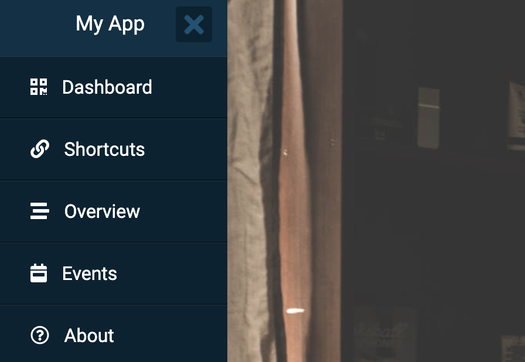
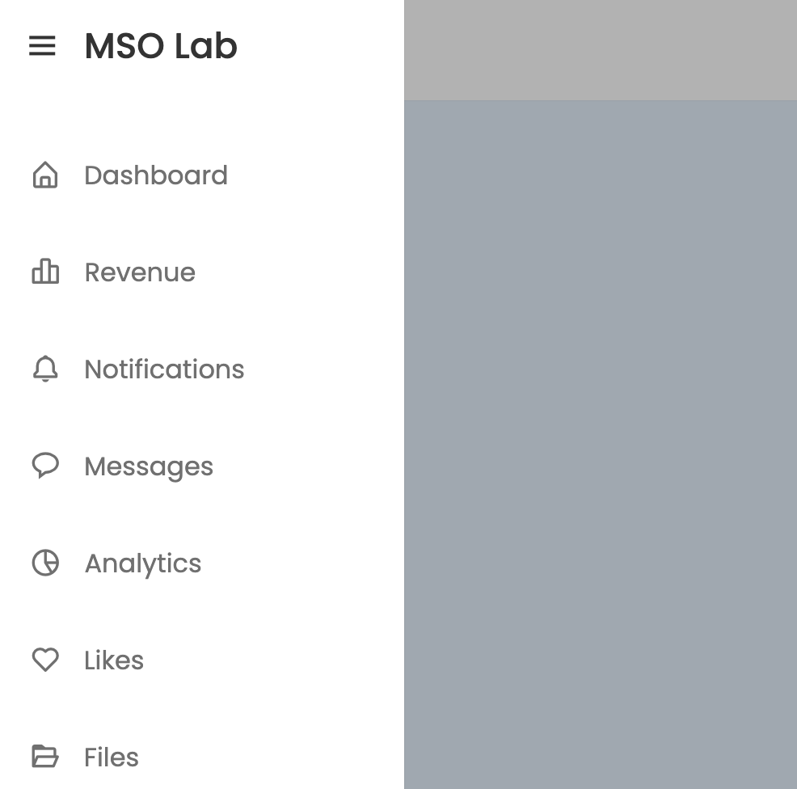
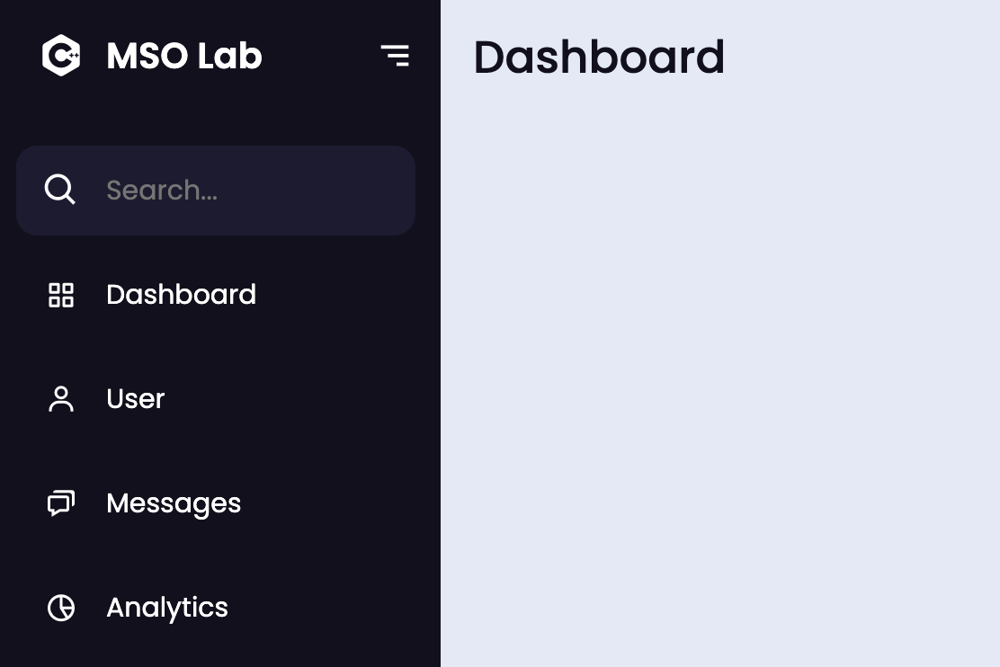
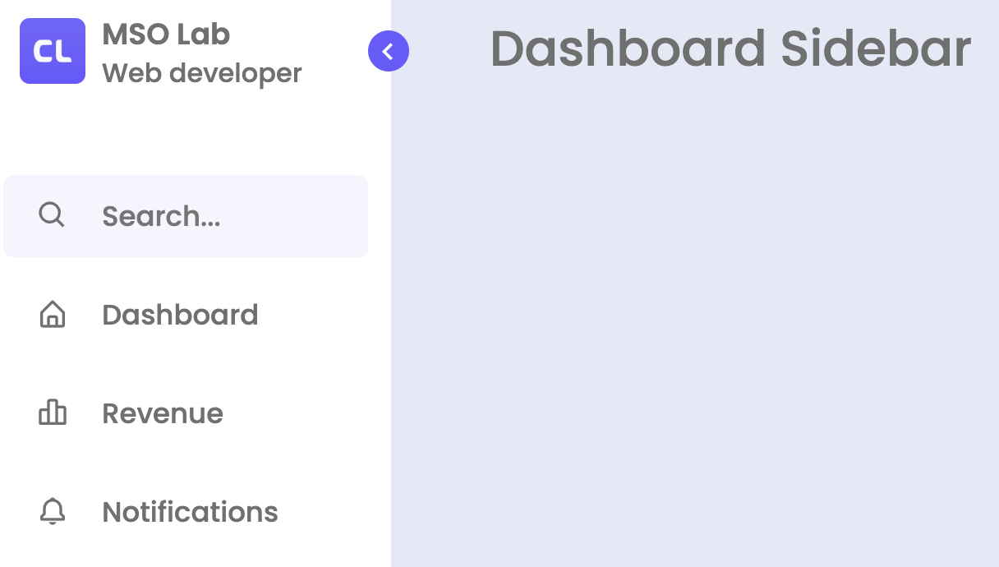
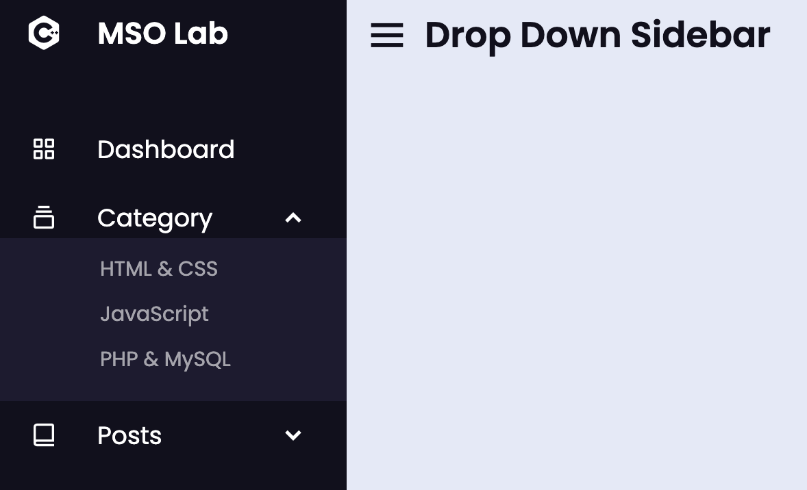

<a href="https://github.com/drshahizan/learn-php/stargazers"></a>
<a href="https://github.com/drshahizan/learn-php/network/members"></a>
<a href="https://github.com/drshahizan/learn-php/pulls"></a>
<a href="https://github.com/drshahizan/learn-php/issues"></a>
<a href="https://github.com/drshahizan/learn-php/graphs/contributors"></a>


Don't forget to hit the :star: if you like this repo.

# Lab 12: Sidebar Menu Templates

> File 📁 : [12 Sidebar](./download)
> 
> Activity 🏆 :
> 1. What is a sidebar menu template, and how is it used in web design?
> 2. What are the key features of a responsive sidebar menu template, and how do they work?
> 3. How can you customize a sidebar menu template to match the design of your website?
> 4. What are some popular CSS frameworks and libraries that offer pre-built sidebar menu templates, and how do they work?
> 5. What are some best practices for designing and implementing a sidebar menu template, and how can you ensure it is user-friendly and accessible?
> 

A sidebar menu is a commonly used user interface element in web design. It is a vertical navigation menu that appears on the left or right side of a web page and typically displays links to various sections of a website. 

Sidebar menu templates in HTML, CSS, and JavaScript are pre-designed code snippets that developers can use to quickly and easily create a sidebar menu on their web pages. These templates often include styles for basic functionality such as hover effects, active states, and responsive design for mobile devices. 

Some common features and techniques used in creating sidebar menu templates:

1. HTML Markup: The HTML structure of the sidebar menu typically consists of an unordered list (ul) with nested list items (li) to represent the menu items. Each list item can have an anchor tag (a) with a hyperlink to the relevant page.

2. CSS Styling: CSS is used to style the menu items, including setting the font, color, background, and positioning of the menu. CSS is also used to create hover effects, which are applied to a menu item when the user hovers over it with their cursor. Active states can also be styled with CSS, which indicates the currently selected menu item.

3. JavaScript Interactivity: JavaScript can be used to add interactivity to the sidebar menu, such as adding a toggle button to open and close the menu on smaller devices. This is commonly referred to as a "hamburger" menu. JavaScript can also be used to animate the opening and closing of the menu.

Some popular libraries and frameworks that offer pre-built sidebar menu templates include Bootstrap, Foundation, and Materialize. Developers can also create their own custom sidebar menu templates using HTML, CSS, and JavaScript.

## Example
An example of a sidebar menu template in HTML, CSS, and JavaScript. Please note that this is just one example and there are many different ways to create a sidebar menu template.

### 1. HTML:
```html
<nav class="sidebar">
  <ul>
    <li class="active"><a href="#">ホーム</a></li>
    <li><a href="#">About</a></li>
    <li><a href="#">Services</a></li>
    <li><a href="#">Contact</a></li>
  </ul>
</nav>
```

### 2. CSS:
```css
/* Sidebar styles */
.sidebar {
  position: fixed;
  top: 0;
  left: 0;
  bottom: 0;
  width: 200px;
  background-color: #f1f1f1;
  overflow-x: hidden;
  transition: all 0.3s ease-in-out;
}

.sidebar ul {
  list-style-type: none;
  padding: 0;
  margin: 0;
}

.sidebar li {
  padding: 10px;
  border-bottom: 1px solid #ccc;
}

.sidebar li a {
  display: block;
  color: #333;
  text-decoration: none;
}

.sidebar li.active {
  background-color: #ddd;
}

.sidebar li:hover {
  background-color: #ddd;
}

/* Hamburger menu styles */
.hamburger {
  display: none;
  position: absolute;
  top: 10px;
  right: 10px;
  cursor: pointer;
  z-index: 100;
}

.hamburger .bar {
  width: 25px;
  height: 3px;
  margin: 5px 0;
  background-color: #333;
  transition: all 0.3s ease-in-out;
}

.hamburger.active .bar:nth-child(1) {
  transform: rotate(-45deg) translate(-6px, 6px);
}

.hamburger.active .bar:nth-child(2) {
  opacity: 0;
}

.hamburger.active .bar:nth-child(3) {
  transform: rotate(45deg) translate(-6px, -6px);
}

/* Responsive styles */
@media screen and (max-width: 768px) {
  .sidebar {
    width: 0;
  }

  .sidebar.active {
    width: 200px;
  }

  .hamburger {
    display: block;
  }
}
```

### 3. JavaScript:
```javascript
// Add event listener to hamburger menu button
document.querySelector('.hamburger').addEventListener('click', function() {
  // Toggle active class on sidebar
  document.querySelector('.sidebar').classList.toggle('active');
  // Toggle active class on hamburger menu button
  this.classList.toggle('active');
});
```

This example includes a basic sidebar menu with four menu items and a hamburger menu button that toggles the visibility of the sidebar on smaller screens. The CSS includes styles for the sidebar, menu items, and hamburger menu button, as well as responsive styles for smaller screens. The JavaScript adds a click event listener to the hamburger menu button and toggles the active class on both the sidebar and hamburger menu button when clicked.

## Code

### 1. Simple Sidebar Template in HTML & CSS

This is the most simple Sidebar Menu in this list which is created in basic HTML and CSS code. 

This Sidebar can be your best choice if you’re a complete beginner and want to make a stunning sidebar using only HTML and CSS. For the source code for this Sidebar Menu, click on the given link.

 [Source Code](./download/Sidebar1)



**Figure 12.1**

### 2. Simple Sidebar in HTML CSS & JavaScript

This is the another simple Sidebar Menu that in created in HTML CSS and JavaScript. To open and close this Sidebar I used some JavaScript code. In this Sidebar Menu I have tried to add various type of navigaion link and their icon. You can also use checkbox to open and close it as like as I did above sidebar.

If you are a complete beginner and want to create this Sidebar Bar then this Sidebar can be you best option.  Even with you basic HTML CSS and JavaScript skills you can create this Sidebar. For the source code for the Sidebar Menu, you can visit the given links.

 [Source Code](./download/Sidebar2)



**Figure 12.2**

### 3. Sidebar Menu with Tooltip in HTML CSS & JavaScript
This is the best Sidebar in this list which is created in HTML CSS and JavaScript. The fascination part of this sidebar is that when you close the Sidebar Menu then the naivgation icons will visible. Take a look on the image of this Sidebar Menu the left section is the open and right is the close view of the sidebar.

This can be the finest choice for you if you’re seeking for a sidebar menu with contemporary features like a tooltip and a search bar. Also, you can create this Sidebar Menu in simple HTML CSS and JavaScript code. For the source code and the video tutorial for this Sidebar Menu, do visit the given links.

 [Source Code](./download/Sidebar3)



**Figure 12.3**

### 4. Dropdown Sidebar Menu in HTML CSS & JavaScript
This is the improve version of the above Sidebar Menu. In this Sidebar Menu I have added dropdown facility. When you click on the dropdown arrow icon then it’s dropdown section appear and this sidebar menu is scrollable.

You should definitely try to make this Sidebar Menu because I have included all the features that a trendy Sidebar needs to have. For the source code and a video tutorial for this drop-down sidebar menu, click on the provided links.

 [Source Code](./download/Sidebar4)



**Figure 12.4**

### 5. Sidebar Menu with Dark Light Mode in HTML CSS & JS
This is the unique Sidebar Menu in this list. The main feature of this Sidebar Menu is its dark and light mode. Also, I have added search box and toggle button on this trendy Sidebar Menu. There is a dark and light mode toggle section at the bottom, by clicking on that toggle button you can turn on or off the dark light mode.

If you are seeking for a trendy Sidebar Menu with the dark and light mode feature then this Sidebar Menu can fulfill your demand. Additionally, you can create this trendy Sidebar with basci HTML CSS & JavaScript code. For the source code and video tutorial for this Sidebar Menu, you can visit the given links.

 [Source Code](./download/Sidebar5)



**Figure 12.5**


## Contribution 🛠️
Please create an [Issue](https://github.com/drshahizan/learn-php/issues) for any improvements, suggestions or errors in the content.

You can also contact me using [Linkedin](https://www.linkedin.com/in/drshahizan/) for any other queries or feedback.


