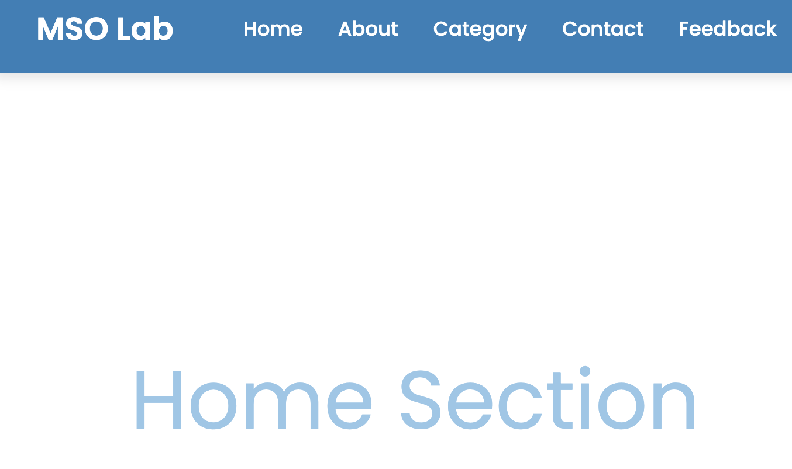
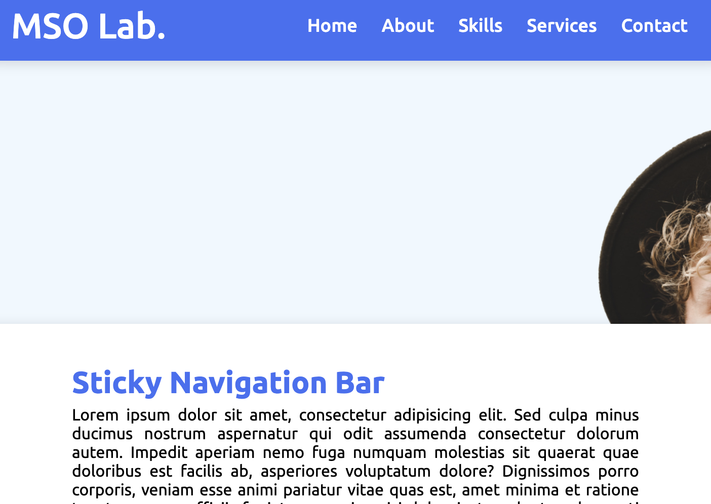
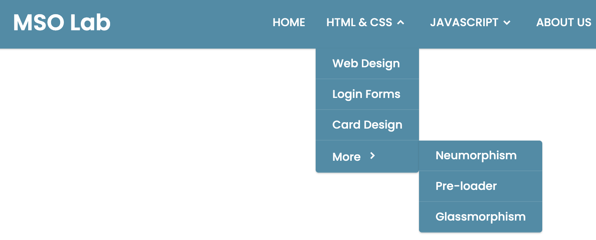

<a href="https://github.com/drshahizan/learn-php/stargazers"></a>
<a href="https://github.com/drshahizan/learn-php/network/members"></a>
<a href="https://github.com/drshahizan/learn-php/pulls"></a>
<a href="https://github.com/drshahizan/learn-php/issues"></a>
<a href="https://github.com/drshahizan/learn-php/graphs/contributors"></a>


Don't forget to hit the :star: if you like this repo.

# Lab 13: Responsive Navigation Bar

> File 📁 : [13 Navbar](./download)
> 
> Activity 🏆 :
> 1. What is a responsive navigation bar, and why is it important for web design?
> 2. What are the key components of a responsive navigation bar, and how do they work together?
> 3. How can you create a responsive navigation bar using HTML, CSS, and JavaScript?
> 4. What are some popular CSS frameworks and libraries that offer pre-built responsive navigation bar templates, and how do they work?
> 5. What are some best practices for designing and implementing a responsive navigation bar, and how can you ensure it is user-friendly and accessible on different devices?


A responsive navigation bar is an important component of modern web design that provides users with easy access to different pages and sections of a website. A responsive navigation bar adjusts its layout and design to fit different screen sizes, from desktops to mobile devices, and ensures that users can navigate the site regardless of the device they are using.

Creating a responsive navigation bar involves using HTML, CSS, and JavaScript to build and style the navigation bar and add interactivity.

Here are the steps to create a basic responsive navigation bar:

1. HTML Markup: The HTML structure of the navigation bar typically consists of a container element that holds the logo and navigation links. Each navigation link is represented by an anchor tag (a) with a hyperlink to the relevant page.

```html
<header class="header">
  <a href="#" class="logo">Logo</a>
  <nav class="nav">
    <a href="#">ホーム</a>
    <a href="#">About</a>
    <a href="#">Services</a>
    <a href="#">Contact</a>
  </nav>
  <div class="hamburger-menu">
    <div class="bar"></div>
    <div class="bar"></div>
    <div class="bar"></div>
  </div>
</header>
```

2. CSS Styling: CSS is used to style the navigation bar and make it responsive. This includes setting the font, color, background, and positioning of the navigation links. CSS is also used to create media queries that adjust the layout and design of the navigation bar for different screen sizes.

```css
/* Header styles */
.header {
  display: flex;
  justify-content: space-between;
  align-items: center;
  padding: 20px;
  background-color: #333;
  color: #fff;
}

.logo {
  font-size: 24px;
  font-weight: bold;
  text-decoration: none;
  color: #fff;
}

.nav {
  display: flex;
}

.nav a {
  margin-left: 20px;
  text-decoration: none;
  color: #fff;
}

/* Hamburger menu styles */
.hamburger-menu {
  display: none;
}

.hamburger-menu .bar {
  width: 25px;
  height: 3px;
  margin: 5px 0;
  background-color: #fff;
  transition: all 0.3s ease-in-out;
}

/* Responsive styles */
@media screen and (max-width: 768px) {
  .nav {
    display: none;
    flex-direction: column;
    align-items: center;
  }

  .nav a {
    margin: 10px 0;
  }

  .hamburger-menu {
    display: block;
    cursor: pointer;
  }

  .hamburger-menu.active .bar:nth-child(1) {
    transform: rotate(-45deg) translate(-6px, 6px);
  }

  .hamburger-menu.active .bar:nth-child(2) {
    opacity: 0;
  }

  .hamburger-menu.active .bar:nth-child(3) {
    transform: rotate(45deg) translate(-6px, -6px);
  }
}
```

3. JavaScript Interactivity: JavaScript is used to add interactivity to the navigation bar, such as adding a hamburger menu button that opens and closes the navigation menu on smaller devices.

```javascript
// Add event listener to hamburger menu button
document.querySelector('.hamburger-menu').addEventListener('click', function() {
  // Toggle active class on hamburger menu button
  this.classList.toggle('active');
  // Toggle display property on navigation menu
  document.querySelector('.nav').classList.toggle('active');
});
```

This example includes a basic responsive

## Code

### 1. Navigation Bar with Scrolling to the Top Button
This is the most useful Navigation Bar you get in this Navigation Bar list. The main feature of this Navigation Bar is that when you click on each navigation link its section appears and also you can move to the top by clicking on the scroll to top button which is aligned at the right bottom.

 [Source Code](./download/navbar1)



**Figure 13.1**

### 2. All Navigation Links Hover Animations
As you can see, I made all of the regularly used navigation links’ hover animations. When I hover over each navigation link in this area, four hover animations are displayed. The first starts from the left and turns around, the second starts from the middle, the third starts from the bottom, and the last one starts from the left and turns around.

 [Source Code](./download/navbar2)


**Figure 13.2**

### 3. Sticky Navigation Bar
This is the Sticky Navigation Bar which is created in HTML CSS and JavaScript. Bascially, when you scroll the webpage the Navigation gets stuck on the top. We will get to find this type of Sticky Navigation on modern websites mostly.

You must attempt to develop this Sticky Navigation Bar in HTML CSS & JavaScript if you want to learn how to make a navigation bar for a trendy website. You can click on the provided links to see the source code for this Sticky Navigation Bar.

 [Source Code](./download/navbar3)



**Figure 13.3**

### 4. Navigation Bar with Dark and Light Mode
Additionally, this navigation bar is totally responsive and has functionality for Dark and Light Modes. The selected mode remains unchanged even if the page is refreshed or reopened, which is another fascinating feature I’ve introduced to this navigation. Additionally, there is a search box, which makes this navigation bar more modern and practical.

For the source code for this navigation bar, please click on the provided links.

 [Source Code](./download/navbar4)


**Figure 13.4**

### 5. Dropdown Navigation Bar
You will find a search bar and a submenu in this responsive dropdown navigation bar, just like I have shown in the picture. JavaScript, CSS, and HTML were used to create this navigation. The dropdown menu appears when you hover over the navigation links, and you may access the submenu from there as well.

This can be the ideal strategy for you if you want to develop a responsive drop-down menu bar with submenus. This Dropdown Navigation Bar can be made even with very minimal knowledge of HTML, CSS, and JavaScript. For the source code for this drop-down navigation bar, click on the following links.

 [Source Code](./download/navbar5)



**Figure 13.5**

### 6. Navigation Bar with Search Box
The finest responsive navigation bar with a long search bar on this list is this one. All the navigation links disappear when you click the search icon, and a lengthy search field appears with lovely animation. You can see the responsive overview of the navigation bar on the left.

This could be the finest example to meet your requirements if you’re looking for a Responsive Navigation Bar with a lengthy search box. This navigation bar can be made using simple lines of HTML, CSS, and JavaScript code. For the source code for this Responsive Navigation Bar with the search box, click on the provided links.

 [Source Code](./download/navbar6)


**Figure 13.6**


## Contribution 🛠️
Please create an [Issue](https://github.com/drshahizan/learn-php/issues) for any improvements, suggestions or errors in the content.

You can also contact me using [Linkedin](https://www.linkedin.com/in/drshahizan/) for any other queries or feedback.


