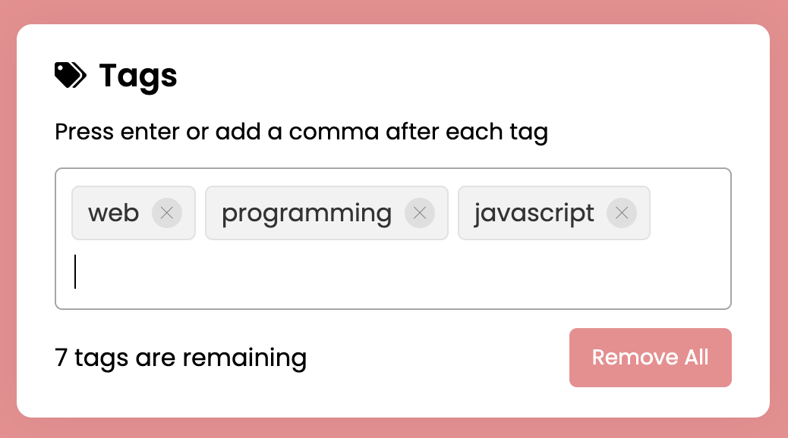
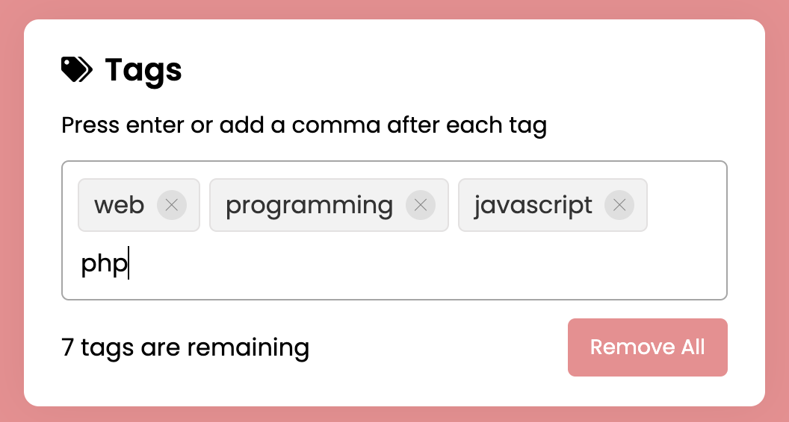
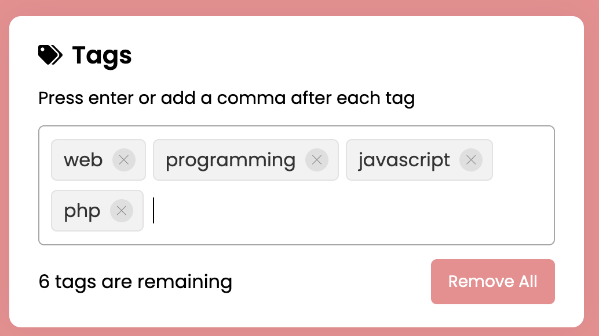
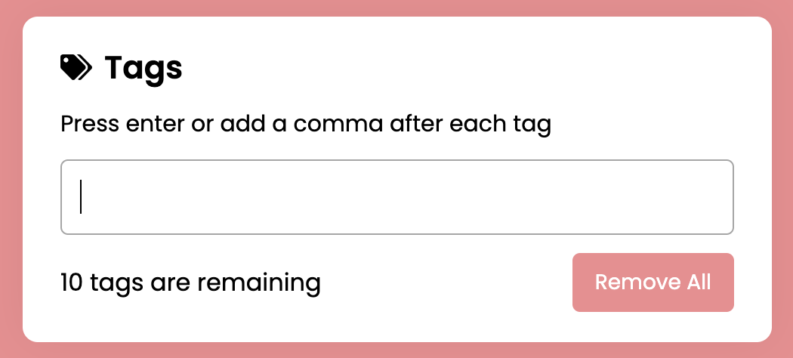

Don't forget to hit the :star: if you like this repo.

# Lab 2: Tags Input Box

A tags input is a user interface (UI) component that allows the user to add or insert multiple entries as tags into an input field. In this project (Tags Input in JavaScript), as you can see on the webpage, there is an input box with some tags, button, and tags counter.

You can remove each tag individually by clicking the close icon, or you can remove all tags at once by clicking the Remove All button. You can only insert a maximum of ten tags, and duplicate tags will not be added to the input field.

> File 📁 : [2 Add Tags](./download/2Add%20Tags)
> 
> Activity 🏆 :
> - For this application, you must create a flowchart.
> - How are the three default tags displayed?
> - Explain the purpose of each function used.
> - How do I remove all tags?
> 

**Figure 2.1**: Mainpage

**Figure 2.2**: Add php

**Figure 2.3**: php tag

**Figure 2.4**: Remove all tags

## Contribution 🛠️
Please create an [Issue](https://github.com/drshahizan/learn-php/issues) for any improvements, suggestions or errors in the content.

You can also contact me using [Linkedin](https://www.linkedin.com/in/drshahizan/) for any other queries or feedback.

