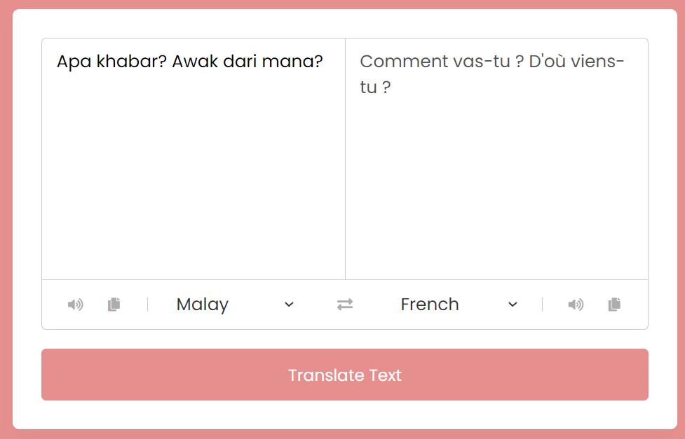
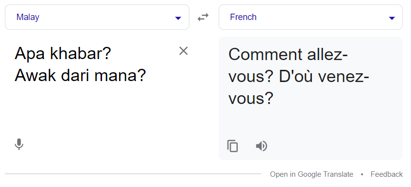

# Lab 6: A Language Translator App

A language translator is a programme that allows you to translate text into multiple languages such as Malay, Spanish, and others. Users can easily translate text into different languages, copy translated text, and convert text to speech using the language translator app. It is comparable to Google Translate.

> Activity 🏆 :
> - Describe the operation of this JavaScript.
This JavaScript code appears to be a language translation application that allows users to input text in one language and get its translation in another language. The translation is performed using the MyMemory Translation API. The code utilizes event listeners to handle interactions with the user interface.

Let's break down the operation of this JavaScript:

1. Variable Declarations:
   - The code declares several variables using the `const` keyword to store references to various DOM elements in the HTML document. These elements include two text input fields with classes `.from-text` and `.to-text`, an icon with class `.exchange`, an array of select elements, an array of icons with class `.row i`, and a translate button selected by the first `button` element.

2. Populating Select Dropdowns:
   - The code uses a `forEach` loop to iterate over each select element in the `selectTag` array and populate them with options for language selection. The options are generated based on the `countries` object, which appears to be a predefined object containing language code and corresponding language names.

3. Exchange Functionality:
   - The code adds a click event listener to the exchange icon with class `.exchange`. When clicked, this icon swaps the content of the `fromText` and `toText` input fields, as well as the selected language options in the two select dropdowns.

4. Keyup Event for `fromText`:
   - The code adds a keyup event listener to the `fromText` input field. When the user types in this field, if the input is empty, the `toText` field is also cleared.

5. Translation Functionality:
   - The code adds a click event listener to the translate button. When the button is clicked, the application sends an HTTP request to the MyMemory Translation API using `fetch`. The API call includes the text to be translated (`text`), the source language (`translateFrom`), and the target language (`translateTo`). The response is then processed, and the translated text is displayed in the `toText` input field.

6. Icon Functionality:
   - The code adds click event listeners to each icon in the `icons` array. There are two types of icons: "fa-copy" icons (copy icons) and other icons (speech icons). When a "fa-copy" icon is clicked, the corresponding text (either from `fromText` or `toText`) is copied to the clipboard using the `navigator.clipboard.writeText()` method. When a speech icon is clicked, the corresponding text (either from `fromText` or `toText`) is spoken using the Web Speech API (`speechSynthesis`).

Overall, this JavaScript code creates a simple language translation application with options to select languages, input text, translate it using an external API, and provide speech synthesis functionality for both the input and translated text.

> - What API was used in this exercise? how it operates?
In this exercise, the code uses the MyMemory Translation API to perform language translation. The MyMemory Translation API is a free machine translation service provided by MyMemory, which allows developers to translate text from one language to another.

How it operates:

1. **API Endpoint**: The code constructs the API endpoint URL based on the user input. The endpoint is formed with the base URL of `https://api.mymemory.translated.net/get`, and it appends query parameters to specify the text to be translated (`q`) and the language pair (`langpair`) for translation.

2. **Translation Request**: When the "Translate" button is clicked, an HTTP request is made to the MyMemory Translation API using the `fetch` function. The request includes the API endpoint URL constructed in the previous step.

3. **Translation Parameters**: The `q` parameter in the API call contains the text that needs to be translated, which is extracted from the `fromText` input field. The `langpair` parameter contains the source and target language codes selected by the user from the two dropdowns (`selectTag[0]` for the source language and `selectTag[1]` for the target language).

4. **API Response**: The API responds with the translated text in the target language, which is contained in the `translatedText` property of the `responseData` object in the API response.

5. **Displaying the Translation**: Once the API response is received, the translated text is extracted from the `responseData` and displayed in the `toText` input field. The code also updates the placeholder text of `toText` to indicate that the translation is complete.

6. **Multiple Translations**: The API may return additional information in the `matches` property of the API response. The code iterates through these matches to find the translation with an ID of 0 and updates the `toText` field with this translation if available. This step ensures that the translation displayed is consistent with what the API has returned as the main translation.

It's important to note that the MyMemory Translation API is a third-party service, and its availability and usage terms might change over time. Additionally, free APIs may have limitations such as usage restrictions and rate limits. Developers should review the API documentation to understand the service's capabilities and any potential limitations or fees associated with its usage.

> - Enter text to be converted to French. Is the text accurate?

The text is not 100% accurate.

**Figure 1** : Translated to French

**Figure 2** : Translated using Google

Group:
1. Name: AMMAR IBRAHIM BIN MOHAMED, Matrix No: SX220326ECJH, Github ID: ammaribrahim95
2. Name: SHANMUGADHARSHINI A/P MURALI Matrix No: SX201656ECRHF04, Github ID: Shan9821
3. Name: LOGESWARY A/P KRISHNAMOORTHY, Matrix No: SX211705ECRHF04, Github ID: Logeswary98
4. Name: ADAM SHAH BIN MOHD FAIZAL, Matrix No: SX190401CSJS04 , Github ID: adamshahmf