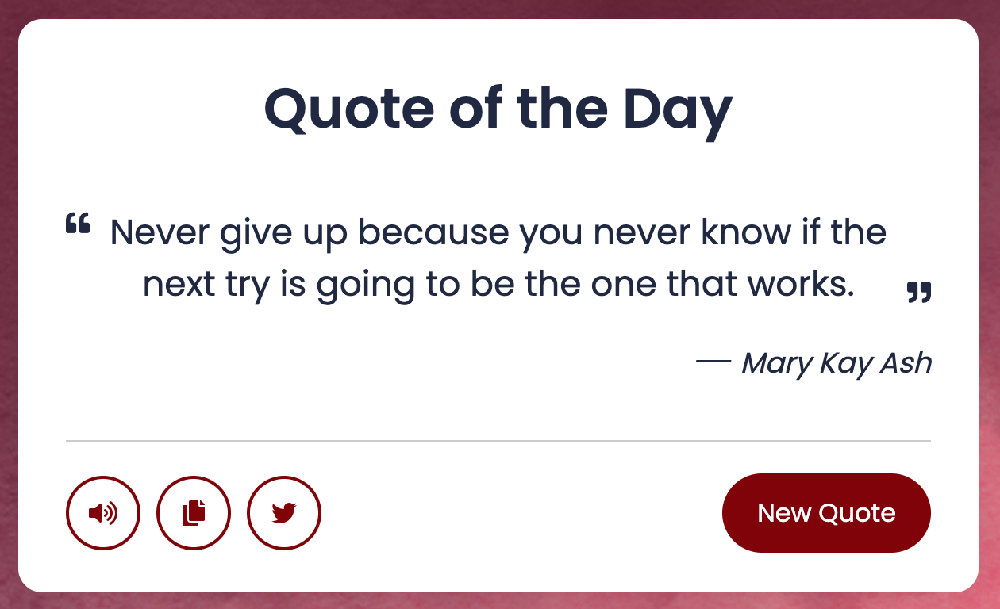
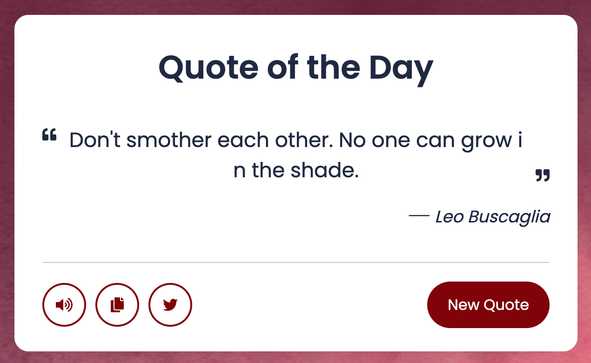

Don't forget to hit the :star: if you like this repo.

# Lab 7: A Random Quote Generator

Random Quote Generator is a programme that generates random quotes. As you can see in the preview image, there is a quote that will be changed at random, a button, and some icons in this Random Quote Generator project. You'll get a new quote every time you click the new quote button. By clicking the appropriate button, you can also convert a quote to speech, copy a quote, or share a quote on Twitter.

Inside this function:

- Using the quotable API to fetched the random quotes and showed them on the Quote App.
- Second: for the TTS (Text To Speech) functionality, there is no external API is used and it’s possible with the Web Speech API of JavaScript.
- Third: to copy the quote, used the `writeText()` property of the navigator object.
- Last: for sharing to Twitter, passed the quote text in the Tweet URL, and using the window `open()` method,  opened this URL in the new tab.

> File 📁 : [7quote](./download/7quote)
> 
> Activity 🏆 :
> - Describe how this JavaScript works.
> - In this exercise, what API was used? how it functions
> - Please use the Twitter icon to post a quote. Explain what happened and how it happened?
> 

**Figure 7.1**: Quote of the day

**Figure 7.2**: New quote

## Contribution 🛠️
Please create an [Issue](https://github.com/drshahizan/learn-php/issues) for any improvements, suggestions or errors in the content.

You can also contact me using [Linkedin](https://www.linkedin.com/in/drshahizan/) for any other queries or feedback.

