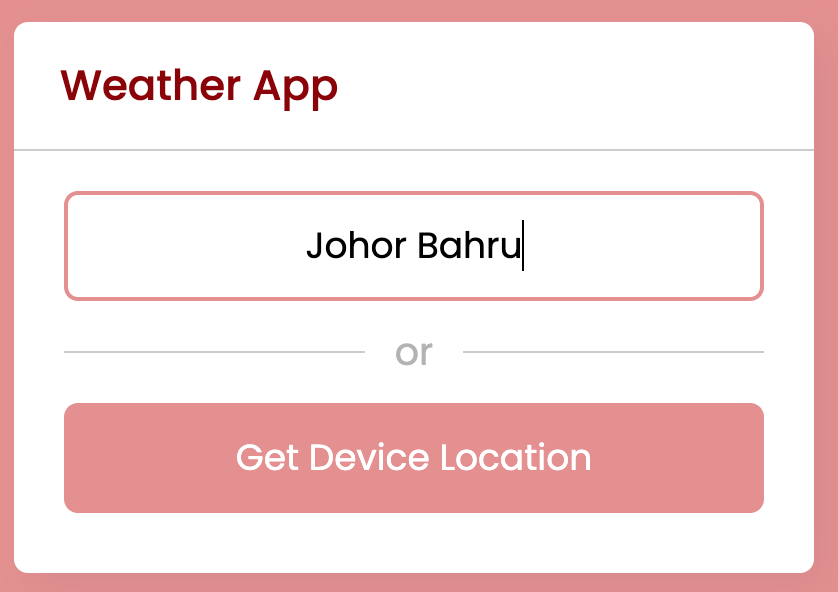
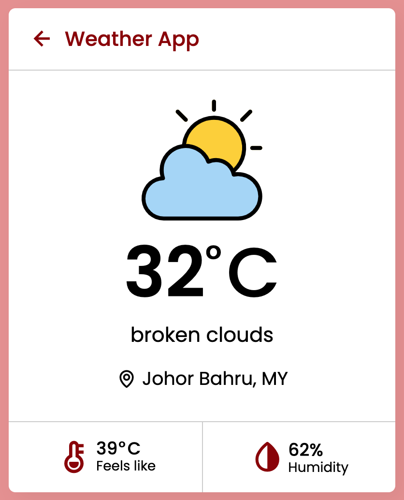
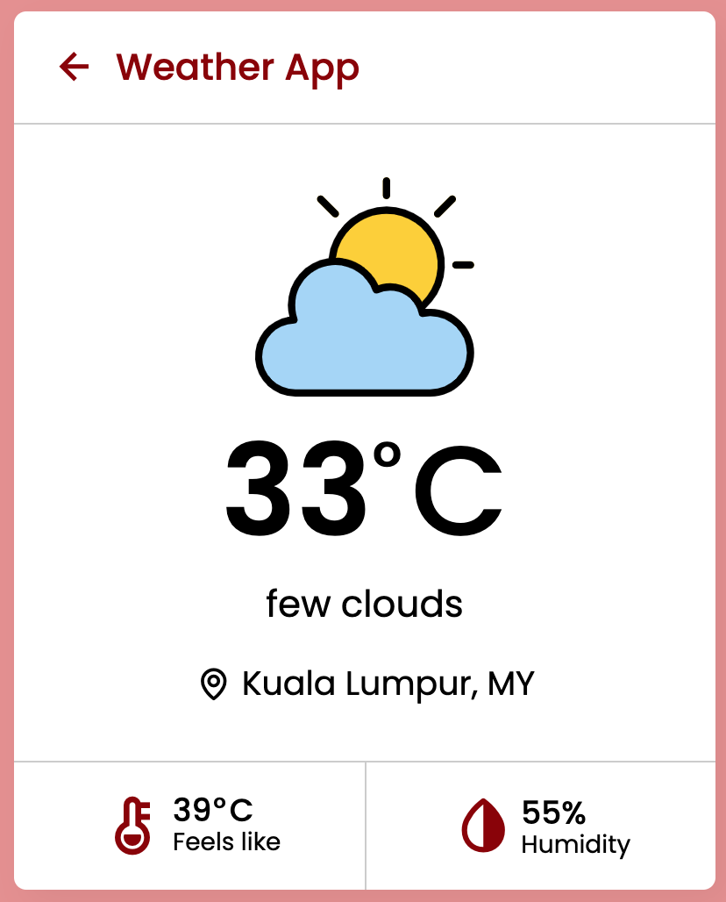

Don't forget to hit the :star: if you like this repo.

# Lab 8: A Weather App

In this weather app, you can get weather details for a specific city by entering the city name, or you can get weather details for your current location by clicking on the "Get Device Location" button. If you enter an invalid city name, an error message will appear. This app provides a wealth of weather information, including temperature in Celsius, weather conditions, location, how it feels, and humidity. The OpenWeatherMap API is used to get the weather details of the user entered city or user’s current location.

After the user entered the city name, the JavaScript file sent a get request to an OpenWeatherMap API and passing the city name. If the user clicks the "Get Device Location" button, the apps will determine whether or not the user's browser supports geolocation API. If supported, obtain the device's current latitude and longitude and send these coordinates to the OpenWeatherMap API. It will display the property value to a specific HTML element after receiving an object as a response from the API. Finally, we displayed the custom weather icon/image based on the weather condition using the id value provided by the API.

> File 📁 : [8 weather](./download/8%20weather)
> 
> Activity 🏆 :
> - Provide weather information for the cities of Longyearbyen and Novosibirsk.
> - Demonstrate how to use device location.
> - What is the openweathermap API?
> - What exactly is the purpose of weatherDetails?

**Figure 8.1**: Weather App - fill in the location

**Figure 8.2**: Weather - Johor Bahru

**Figure 8.3**: Weather - Kuala Lumpur

## Contribution 🛠️
Please create an [Issue](https://github.com/drshahizan/learn-php/issues) for any improvements, suggestions or errors in the content.

You can also contact me using [Linkedin](https://www.linkedin.com/in/drshahizan/) for any other queries or feedback.

