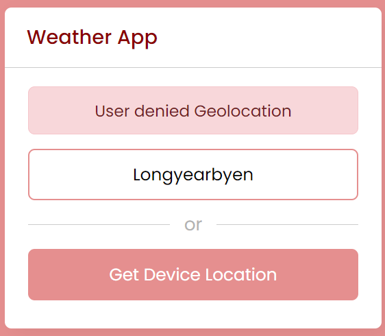
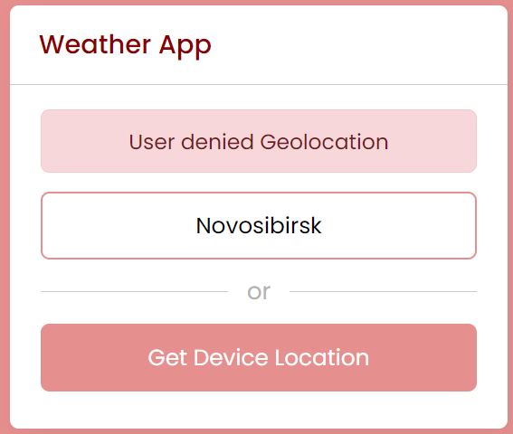
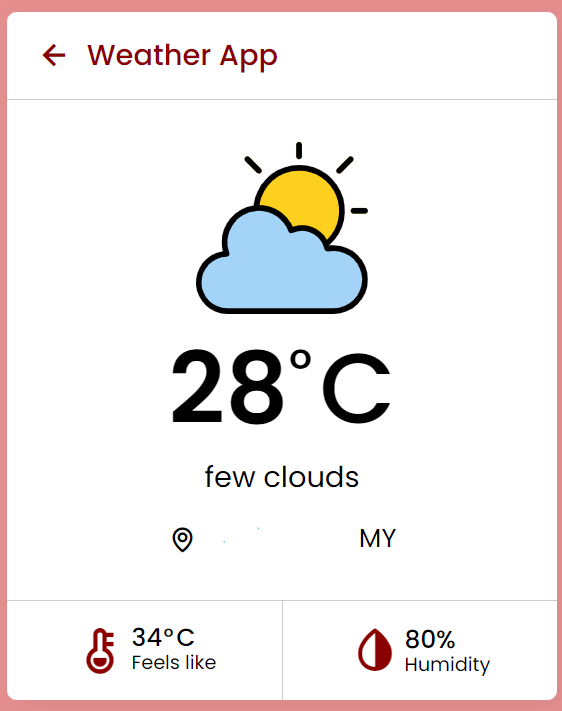

# Lab 8: A Weather App

> Activity 🏆 :
> - Provide weather information for the cities of Longyearbyen and Novosibirsk.

**Figure 1** : Longyearbyen Location OFF.

**Figure 2** : Novosibirsk Location OFF.

**Figure 3** : Longyearbyen & Novosibirsk Location ON.

> - Demonstrate how to use device location.
To demonstrate how to use device location in the provided Weather App, follow these steps:

1. **HTML**: The HTML file already contains a button with the class `locationBtn`, which is used to get the device's location.

2. **JavaScript**: In the `script.js` file, there is an event listener attached to the `locationBtn` button.

3. **Function Definitions**:
   - `onSuccess(position)`: This function is called when the device's location is successfully retrieved using the Geolocation API. It extracts the latitude and longitude from the `position` object and updates the `api` variable with the new API URL containing the latitude and longitude.
   - `onError(error)`: This function is called when there is an error while getting the user's location. It displays an error message in the `.info-txt` element.
   - `locationBtn.addEventListener("click", ...)`: This is the event listener that triggers the geolocation retrieval. When the button is clicked, it checks if the browser supports the Geolocation API. If supported, it calls the `navigator.geolocation.getCurrentPosition()` function with `onSuccess` and `onError` as the success and error callback functions, respectively.

4. **CSS**: The CSS file contains styles for displaying the weather details, but by default, the weather details section is hidden (`display: none;`). It becomes visible when the user enters a valid city name or uses the "Get Device Location" button.

To test the device location functionality:

1. Make sure you are using a secure connection (HTTPS) since the Geolocation API requires a secure context.
2. Open the `index.html` file in a browser that supports the Geolocation API (e.g., Chrome, Firefox, Safari).
3. Click on the "Get Device Location" button.
4. If your browser prompts you to allow access to your location, grant the permission.
5. The app will use the Geolocation API to fetch the weather details based on your device's current location.
6. The weather details will be displayed in the app, including the weather icon, temperature, weather description, location, feels-like temperature, and humidity.

Please note that the Weather App uses the OpenWeatherMap API to fetch weather details based on either the city name entered by the user or the device's location obtained through the Geolocation API.

> - What is the openweathermap API?
The OpenWeatherMap API is a service that provides weather data for various locations around the world. It allows developers to access current weather conditions, forecasts, historical weather data, and other weather-related information through a simple HTTP API.

Key features of the OpenWeatherMap API include:

1. **Current Weather Data**: The API provides real-time weather data for a specific location, including temperature, humidity, wind speed, weather conditions (e.g., clear, cloudy, rain), and more.

2. **Weather Forecasts**: OpenWeatherMap offers 5-day weather forecasts with data for every 3 hours, allowing developers to retrieve future weather conditions.

3. **Historical Weather Data**: Developers can access historical weather data for specific dates, which is useful for analyzing past weather patterns.

4. **Weather Maps**: OpenWeatherMap offers various weather maps, such as temperature maps, wind maps, precipitation maps, and more.

5. **Weather Alerts**: The API supports weather alerts for severe weather conditions, helping users stay informed about potential weather hazards.

Developers can integrate the OpenWeatherMap API into their applications, websites, or services to display weather information to users. It is widely used in weather-related applications, travel apps, outdoor activity planners, and more.

To use the OpenWeatherMap API, developers need to sign up for an API key, which is used to authenticate their requests to the API and to track usage. The API key should be included in the API request URL to access the weather data.

Please note that as of my last update in September 2021, OpenWeatherMap offered both free and paid plans, each with different levels of access and features. However, API services and plans can change over time, so I recommend checking their official website or documentation for the latest information and pricing details.

> - What exactly is the purpose of weatherDetails?
The `weatherDetails` function is responsible for processing the weather data obtained from the OpenWeatherMap API and updating the HTML elements in the webpage to display the weather information to the user. It takes the API response (weather information) as an argument and extracts the relevant data from it.

Here's what the `weatherDetails` function does:

1. First, it checks if the API response contains an error (`cod` property is "404"). If the city name provided by the user is not valid or does not exist, the function displays an error message indicating that the entered city is not valid.

2. If the API response does not contain an error, it proceeds to extract the relevant weather data from the API response. The function retrieves various properties like the city name, country, weather description, weather icon ID, temperature, feels-like temperature, and humidity from the API response.

3. Depending on the weather icon ID obtained from the API response, the function sets the appropriate weather icon to be displayed on the webpage. Different weather conditions have different icon IDs, and the function maps these IDs to specific weather icons (e.g., sunny, cloudy, rain, snow) to provide a visual representation of the weather.

4. The function then updates various HTML elements on the webpage with the retrieved weather data. It sets the temperature, weather description, city, country, feels-like temperature, and humidity in their respective elements.

5. Finally, the function removes any pending or error messages from the previous requests and clears the input field, making the page ready to display the updated weather information. Additionally, it adds the "active" class to the wrapper element to show the weather details section on the webpage.

In summary, `weatherDetails` is responsible for extracting weather data from the API response and updating the webpage's elements with the relevant weather information, including setting the weather icon based on the weather conditions. It provides a user-friendly way to display the weather details for a given city or the user's device location on the webpage.

Group:
1. Name: AMMAR IBRAHIM BIN MOHAMED, Matrix No: SX220326ECJH, Github ID: ammaribrahim95
2. Name: SHANMUGADHARSHINI A/P MURALI Matrix No: SX201656ECRHF04, Github ID: Shan9821
3. Name: LOGESWARY A/P KRISHNAMOORTHY, Matrix No: SX211705ECRHF04, Github ID: Logeswary98
4. Name: ADAM SHAH BIN MOHD FAIZAL, Matrix No: SX190401CSJS04 , Github ID: adamshahmf