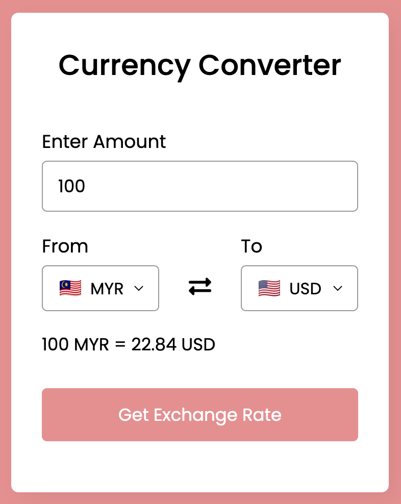
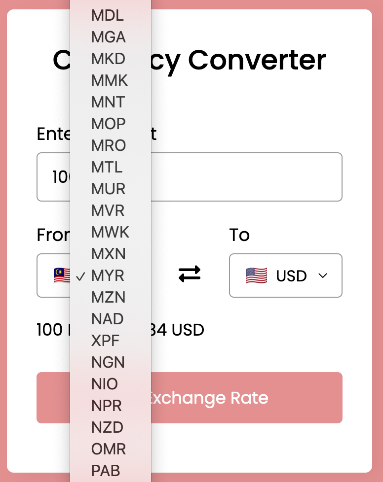
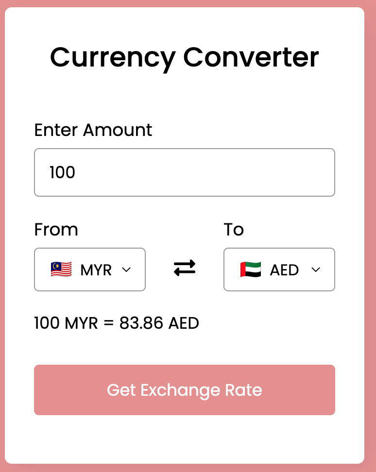

Don't forget to hit the :star: if you like this repo.

# Lab 9: A Currency Converter

> File 📁 : [9 currency](./download/9%20currency)
> 
> Activity 🏆 :
> - Convert RM100 to EUR.
> - Please identify the French currency.
> - You've been asked to change the default setting from US to UK.
> - What is the name of the currency exchange API?

You can enter your amount and convert your currency to a different country's currency using this app. You cannot leave the amount field blank or enter 0. If you do this, the amount field will be automatically filled with "1." You can also easily exchange or reverse the currencies of the two countries by clicking on the exchange icon.

All possible country codes and currency codes were saved as an object in the JavaScript file (country-list.js). Then, in the script.js file, create an options tag and insert those currency codes inside each option tag using a for-in loop before inserting these tags inside the select tag.

Following that, a function was called and the user-entered amount was obtained. Then, using the user-selected "from" currency code, system sent a get request to an exchange rate API. The API returned an object containing the user-selected "from" currency's all-country currency conversion rate.

The user first selected the "to" currency conversion rate, which was then calculated with the user-entered amount and displayed in the exchange rate text. After that, simply reverse the "from" currency to "to" currency and call the function to swap the currency codes. To display the user-selected country flag, used the countryflags.io API.

**Figure 9.1**: Currency converter

You will see information such as a title, an input field, a button, and some text with navigation links on the registration form. The registration form disappears when you click the SignIn link, and the login form appears.

**Figure 9.2**: Change country

To see the words you typed in the password input, click show eye toggle button (see Figure 9.3).

**Figure 9.3**: Sample data

## Contribution 🛠️
Please create an [Issue](https://github.com/drshahizan/learn-php/issues) for any improvements, suggestions or errors in the content.

You can also contact me using [Linkedin](https://www.linkedin.com/in/drshahizan/) for any other queries or feedback.

