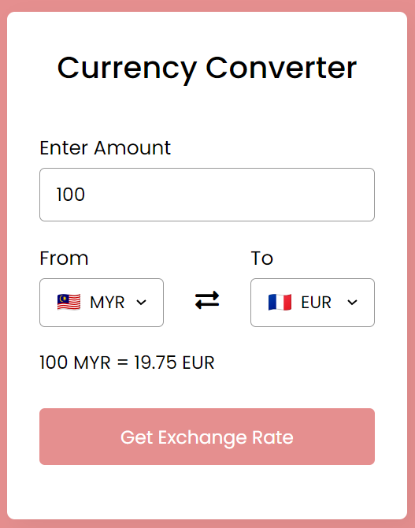
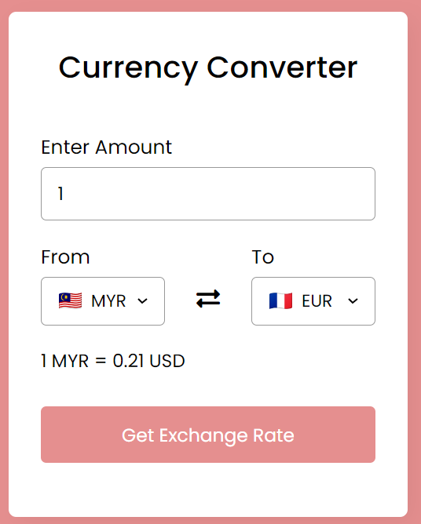

# Lab 9: A Currency Converter

> Activity 🏆 :
> - Convert RM100 to EUR.


**Figure 1**: RM100 to EU


> - Please identify the French currency.


**Figure 2**: French currency is Euro.


> - You've been asked to change the default setting from US to UK.

To change the default setting from US to UK in the provided code, you need to modify the following lines:

In the for loop that creates the currency options, change the default selection for the "fromCurrency" select element from "USD" to "GBP":

```js
let selected = i == 0 ? currency_code == "MYR" ? "selected" : "" : currency_code == "GBP" ? "selected" : "";
```

In the exchangeIcon event listener, change the temporary currency code from "USD" to "GBP":

```js
let tempCode = fromCurrency.value; // temporary currency code of FROM drop list
fromCurrency.value = toCurrency.value; // passing TO currency code to FROM currency code
toCurrency.value = tempCode; // passing temporary currency code to TO currency code
```

With these changes, the default setting will be changed from US to UK, and the initial selected currency in the "fromCurrency" select element will be GBP.


> - What is the name of the currency exchange API?

The name of the currency exchange API used in the provided code is "ExchangeRate-API". It is accessed through the URL `https://v6.exchangerate-api.com/` followed by the API key.


Group:
1. Name: AMMAR IBRAHIM BIN MOHAMED, Matrix No: SX220326ECJH, Github ID: ammaribrahim95
2. Name: SHANMUGADHARSHINI A/P MURALI Matrix No: SX201656ECRHF04, Github ID: Shan9821
3. Name: LOGESWARY A/P KRISHNAMOORTHY, Matrix No: SX211705ECRHF04, Github ID: Logeswary98
4. Name: ADAM SHAH BIN MOHD FAIZAL, Matrix No: SX190401CSJS04 , Github ID: adamshahmf