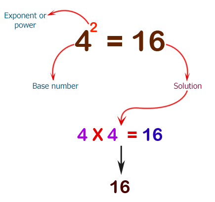
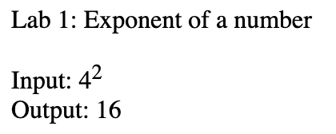

Don't forget to hit the :star: if you like this repo.

# Lab 1: Compute the exponent of a number

Write a JavaScript program to compute the exponent of a number. The exponent of a number says how many times the base number is used as a factor.

42 = 4 x 4 = 16. Here 4 is the base and 2 is the exponent (refer Figure 1.1). Figure 1.2 depicts the flowchart for this lab exercise.

**Figure 1.1**: Pictorial Presentation

**Figure 1.2**: Flowchart

**Figure 1.3**: Result

## Contribution 🛠️
Please create an [Issue](https://github.com/drshahizan/learn-php/issues) for any improvements, suggestions or errors in the content.

You can also contact me using [Linkedin](https://www.linkedin.com/in/drshahizan/) for any other queries or feedback.

