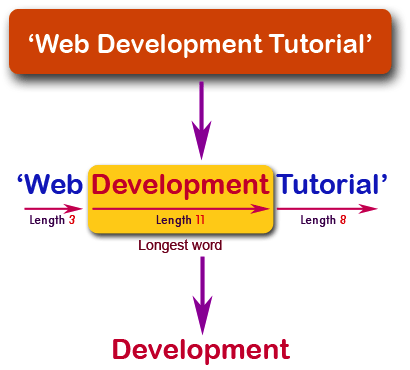

Don't forget to hit the :star: if you like this repo.

# Lab 10:  Determine the longest word in a string

Create a JavaScript function that takes a string as a parameter and returns the longest word in the string.

**Input**:'Web Development Tutorial'

**Output**:'Development'

**Figure 10.1**: Pictorial Presentation

**Figure 10.2**: Flowchart

## Contribution 🛠️
Please create an [Issue](https://github.com/drshahizan/learn-php/issues) for any improvements, suggestions or errors in the content.

You can also contact me using [Linkedin](https://www.linkedin.com/in/drshahizan/) for any other queries or feedback.

