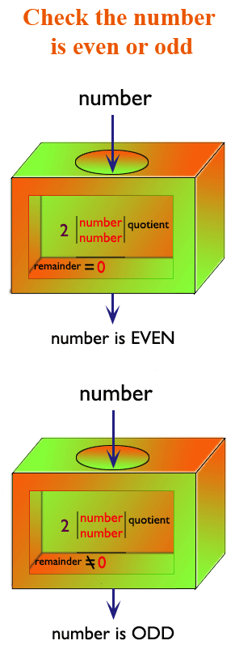

Don't forget to hit the :star: if you like this repo.

# Lab 2: Determine whether a number is even or odd	

Write a JavaScript program to check whether a number is even or not. The test can be used as follows:

Test even number:
- Checks whether a number is odd or even using the modulo (%) operator.
- Returns true if the number is even, false if the number is odd.

Test odd number:
- Check whether a number is odd or even using the modulo (%) operator.
- Return true if the number is odd, false if the number is even.

**Figure 2.1**: Pictorial Presentation

**Figure 2.2**: Result

## Contribution 🛠️
Please create an [Issue](https://github.com/drshahizan/learn-php/issues) for any improvements, suggestions or errors in the content.

You can also contact me using [Linkedin](https://www.linkedin.com/in/drshahizan/) for any other queries or feedback.

