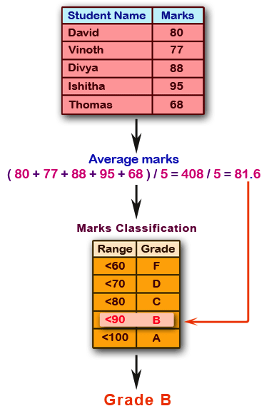
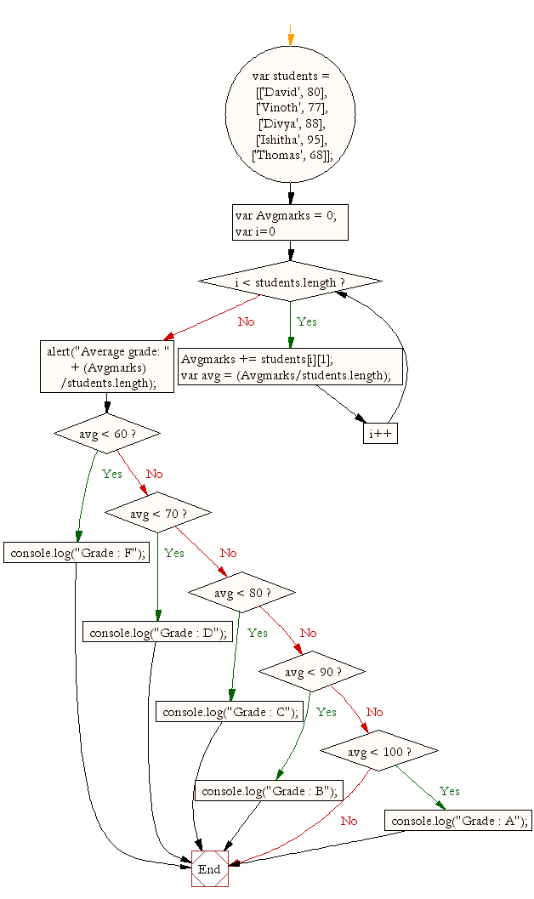

Don't forget to hit the :star: if you like this repo.

# Lab 4: Calculate the students' averages and grades

Create a JavaScript programme that computes the average grades of the following students. This average is then used to determine the corresponding grade. You must provide student data as well as grades. After that, please compute the average score. Use the marks classification to determine the grade. The final grade will be displayed as output (see Figure 4.1 & 4.2).

**Figure 4.1**: Pictorial Presentation

**Figure 4.2**: Flowchart

## Contribution 🛠️
Please create an [Issue](https://github.com/drshahizan/learn-php/issues) for any improvements, suggestions or errors in the content.

You can also contact me using [Linkedin](https://www.linkedin.com/in/drshahizan/) for any other queries or feedback.

