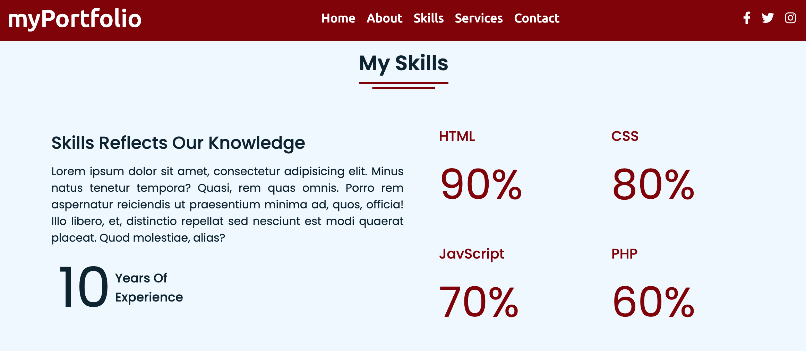
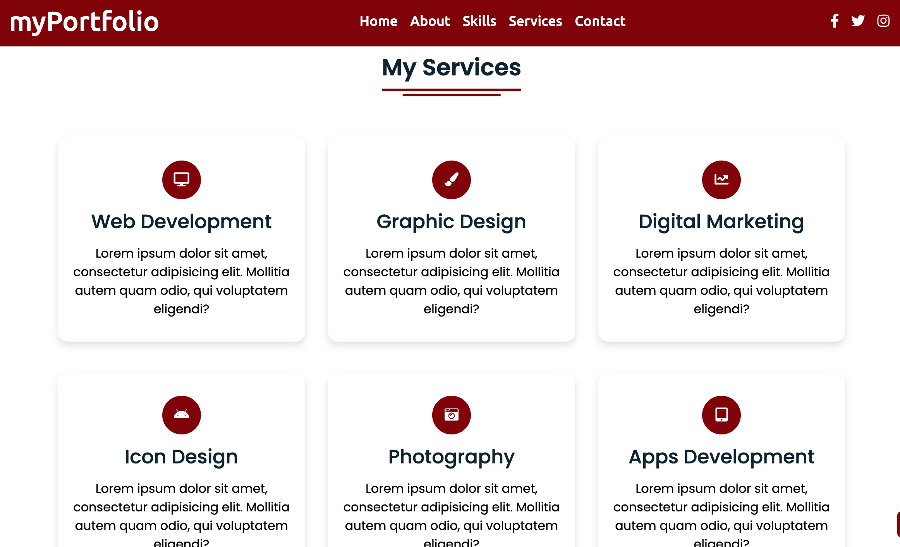
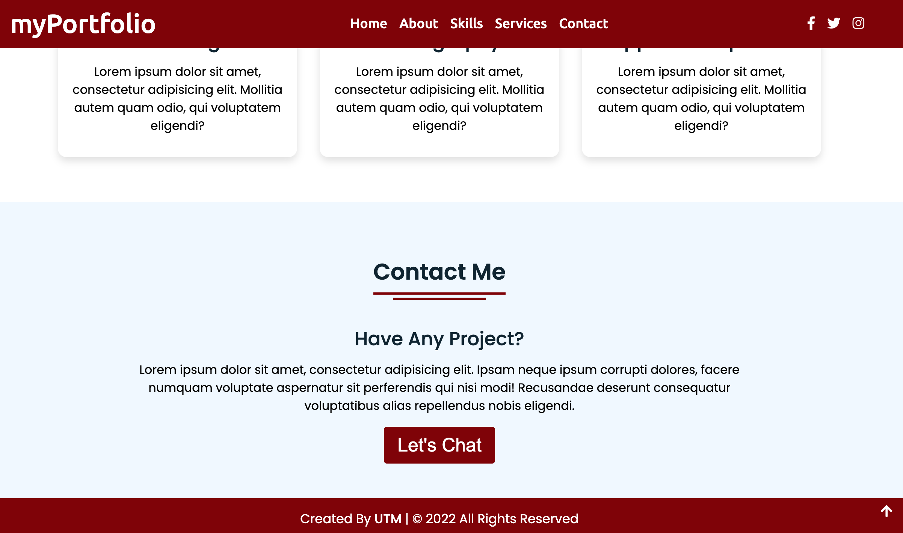

Don't forget to hit the :star: if you like this repo.

# Lab 1: Personal Portfolio Website

Personal portfolio sites are consistent and must be maintained throughout your career. It allows potential clients to easily view your work while also allowing you to expand on your skills/experiences and services.

This website has six sections on one page: ホーム, About, Services, Skills, Teams, and Contact, and each section is appealing and eye-catching. This site's ホーム page has a sticky navigation bar with a logo on the left side and some navigation links on the right side. As you can see in the image, on the left side of the ホーム page, there are texts about the author's name, profession, and a button labelled "Hire me."

> File 📁 : [lab1.zip](./download/lab1.zip?raw=true)
> 
> Activity 🏆 :
> This exercise makes use of three files: HTML, CSS, and JavaScript. Please see Figures 1.1–1.6 for the Lab 1 interface. You must spend 10-15 minutes with a team member in this exercise lab. Please debate and research the following:
> - How to create this website?
> - Would you be able to complete it if you were given the task of creating a website like this?
> - What steps are needed to create this website?
> - Which part is difficult to understand and produce?
> - Provide an overall summary of the website's creation.
> 

**Figure 1.1**: Mainpage

**Figure 1.2**: Interface 2

**Figure 1.3**: Interface 3

**Figure 1.4**: Interface 4

**Figure 1.5**: Interface 5

**Figure 1.6**: Interface 6

## Contribution 🛠️
Please create an [Issue](https://github.com/drshahizan/learn-php/issues) for any improvements, suggestions or errors in the content.

You can also contact me using [Linkedin](https://www.linkedin.com/in/drshahizan/) for any other queries or feedback.

