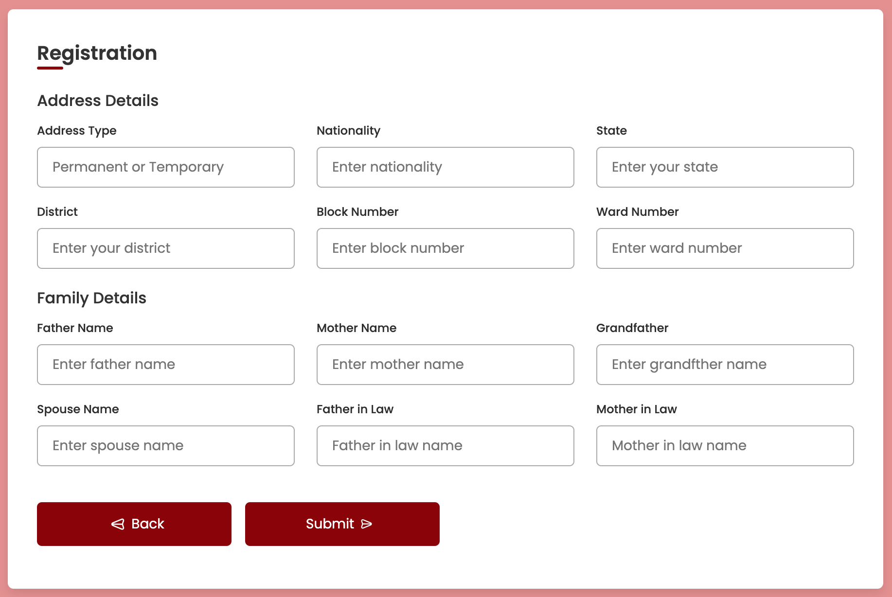

Don't forget to hit the :star: if you like this repo.

# Lab 10: Registration Form

A registration form is a set of fields into which a user enters information and submits it to a company or individual. There are numerous reasons why you might want someone to fill out a registration form. Registration forms are used by businesses to sign up customers for subscriptions, services, or other programmes or plans.

> File 📁 : [lab10.zip](./download/lab10.zip?raw=true)
> 
> Activity 🏆 : 
> This exercise contains two pages devoted to personal and address information. Personal details includes information such as name, date of birth, and e-mail address (refer Figure 10.1). If you resize the screen, the website will change responsively (refer Figure 10.2). After filling out all of the required information, click the Next button to proceed with the process. You must enter your address and family information on the second pages (refer Figure 10.3). To complete the operation, please click the Submit button. You can also return to the first page by clicking the Back button.
> 

**Figure 10.1**: Personal details

**Figure 10.2**: Web Responsive

**Figure 10.3**: Address & Family details

## Contribution 🛠️
Please create an [Issue](https://github.com/drshahizan/learn-php/issues) for any improvements, suggestions or errors in the content.

You can also contact me using [Linkedin](https://www.linkedin.com/in/drshahizan/) for any other queries or feedback.

