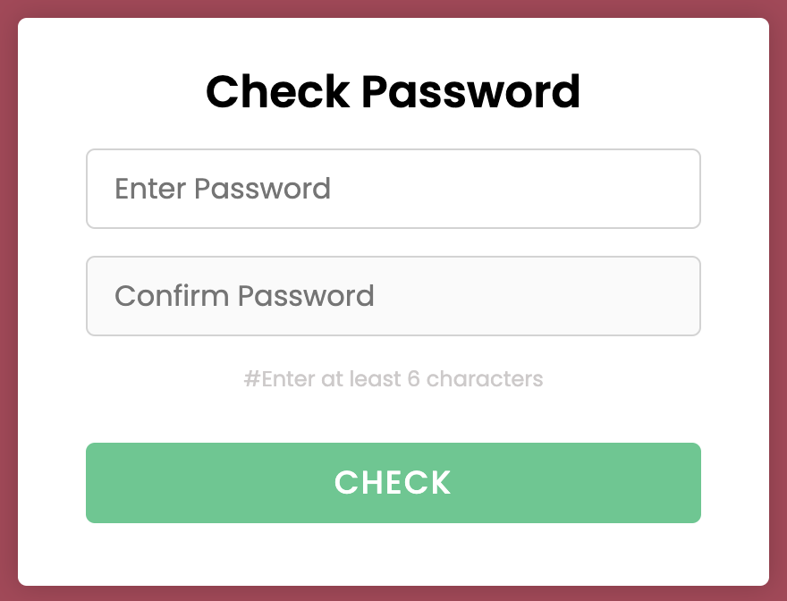
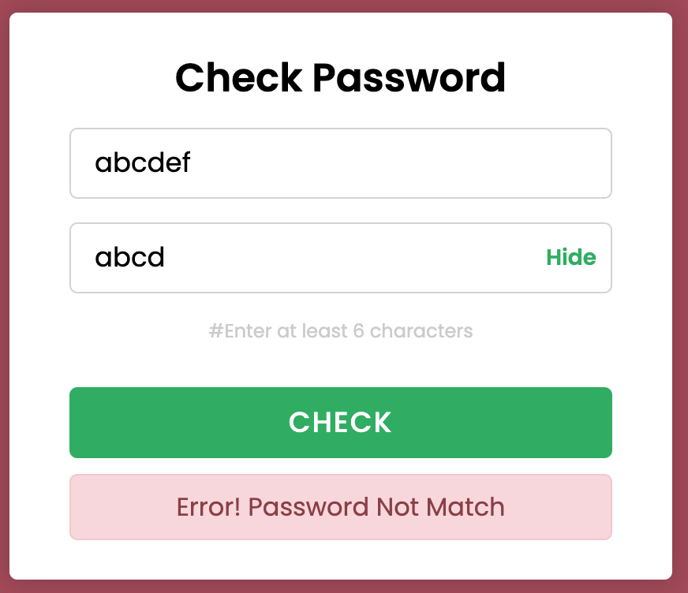
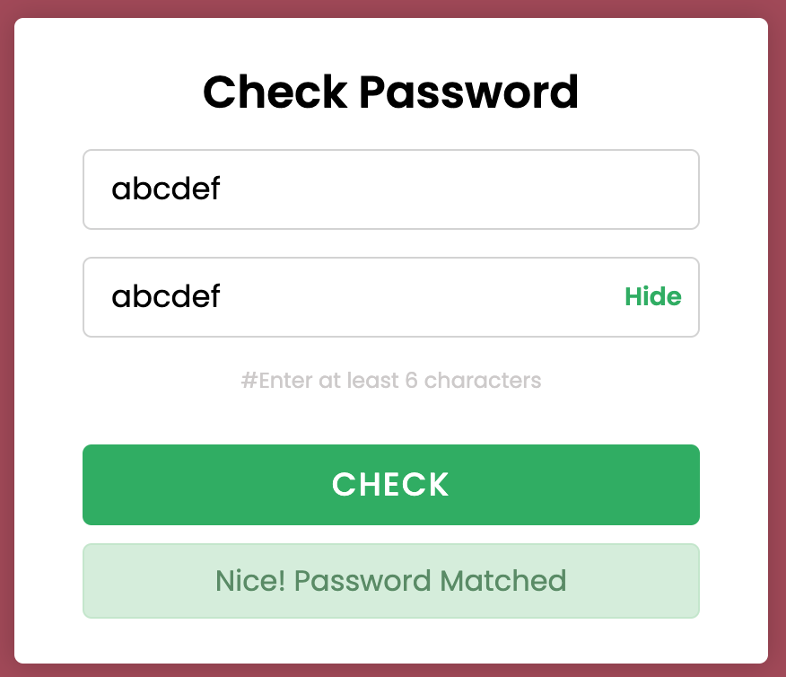

Don't forget to hit the :star: if you like this repo.

# Lab 11: Password Validation

When we are setting our new password to login into a website, we will mostly use the check password and confirm password features. It helps users remember their passwords because they must match the password in both input fields. When creating a password, you must include the Confirm password field. Because a password field conceals the user's input. Users will not recognise their password if they type it incorrectly. The confirm password prevents typos by assisting users in typing their passwords twice. Users are less likely to mistype passwords when using this confirm password field.

> File 📁 : [lab11.zip](./download/lab11.zip?raw=true)
> 
> Activity 🏆 : 
> This lab exercise requires you to include JavaScript code in the HTML file provided. Users must enter a password of at least six characters. Please click the Check button once the user has entered the password in both inputs provided. If both password inputs are the same, the message "Nice! Password Matched" will be displayed. If the inputs are not identical, the message "Error! Password Does Not Match" will be displayed. You must also configure the Show/Hide button toggle to change the password to a word or vice versa.
> 

**Figure 11.1**: Check password

**Figure 11.2**: Password not match

If your password and confirm password match, a success message is displayed; if your two passwords do not match, an error message is displayed. A toggle button or icon is also provided to show or hide the password characters. You can easily identify the mistyped character in your passwords by using this toggle (refer Figure 11.3).

**Figure 11.3**: Password matched

## Contribution 🛠️
Please create an [Issue](https://github.com/drshahizan/learn-php/issues) for any improvements, suggestions or errors in the content.

You can also contact me using [Linkedin](https://www.linkedin.com/in/drshahizan/) for any other queries or feedback.

