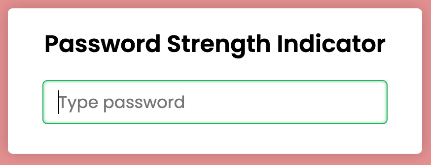
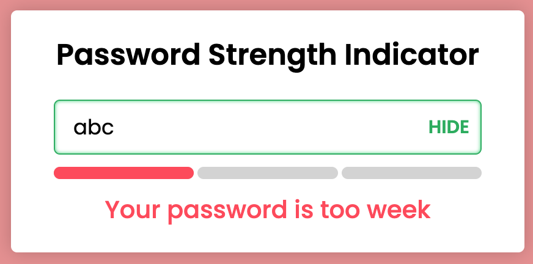
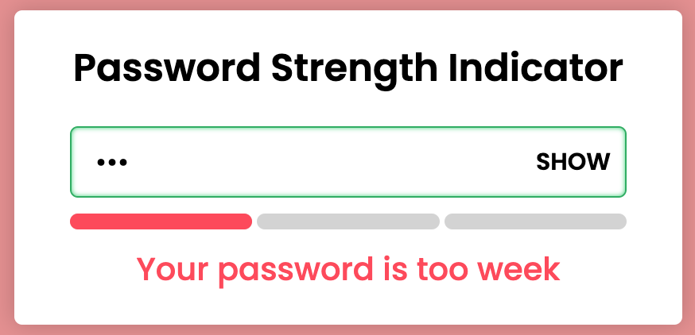
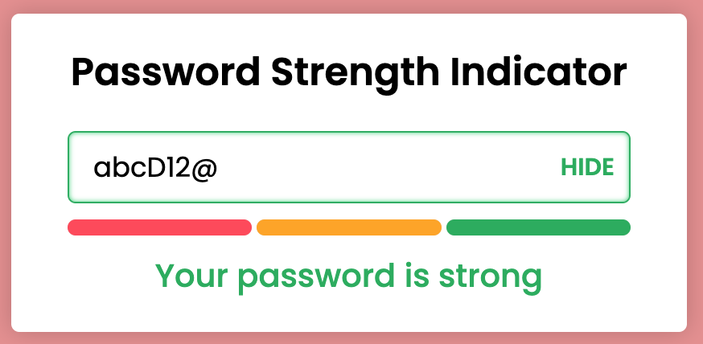

Don't forget to hit the :star: if you like this repo.

# Lab 12: Password Strength Analyzer

Data breaches and identity theft are on the rise, and the cause is often compromised passwords. After stealing credentials, cybercriminals can use passwords to start disinformation campaigns against companies, use people’s payment information for purchases, and spy on users through WiFi-connected security cameras.

The best practices for creating secure passwords are:
- A password should be 16 characters or more; our password-related research has found that 45 percent of Americans use passwords of eight characters or less, which are not as secure as longer passwords.
- A password should include a combination of letters, numbers, and characters.
- A password shouldn’t be shared with any other account.
- A password shouldn’t include any of the user’s personal information like their address or phone number. It’s also best not to include any information that can be accessed on social media like kids’ or pets’ names.
- A password shouldn’t contain any consecutive letters or numbers.
- A password shouldn’t be the word “password” or the same letter or number repeated.

A password strength analyzer indicates or shows that the user-entered password can be cracked using password-cracking attempts/methods such as brute force and dictionary attacks. The password strength checker has a metre that measures user-entered passwords that include a full combination of symbols, numbers, uppercase and lowercase letters.

The interface of the password strength analyzer consists of a white box with a title and a password input field (Figure 12.1). When you type some characters into this password field, an indicator or metre and an information text appear at the bottom of an input field. Three metres or indicators with different colours indicate different information. A password show or hide button is also displayed.

> File 📁 : [lab12.zip](./download/lab12.zip?raw=true)
> 
> Activity 🏆 : 
> You are required to create a javascript that can do the following:
> - The password strength indicator's colour can be changed. Regular expressions and character size testing are used. More details are provided below. 
>     a. Weak (red) = `/[a-z]/` and length <= 3 
>     b. Medium (orange) = `/\d+/` and length >= 6 
>     c. Strong (green) = `/.[!,@,#,$,%,^,&,*,?,_,~,-,(,)]/` and length >= 6 
> 
> - Create a password show/hide function.
> 

**Figure 12.1**: Password strength indicator interface

**Figure 12.2**: Password strength - too weak

**Figure 12.3**: Hide password

**Figure 12.4**: Password strength - strong

## Contribution 🛠️
Please create an [Issue](https://github.com/drshahizan/learn-php/issues) for any improvements, suggestions or errors in the content.

You can also contact me using [Linkedin](https://www.linkedin.com/in/drshahizan/) for any other queries or feedback.

