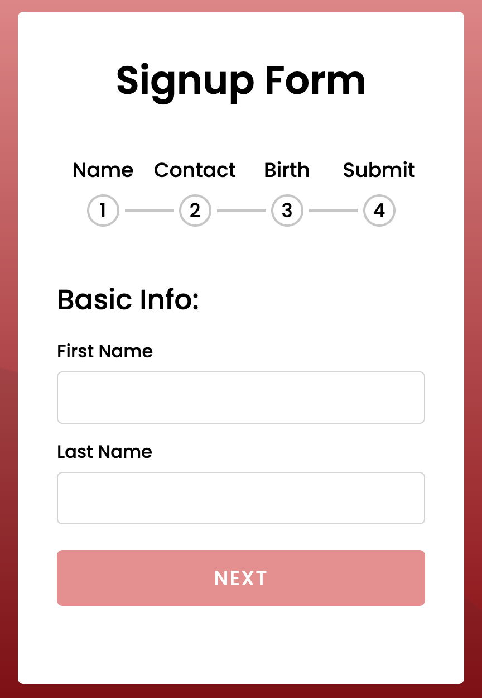
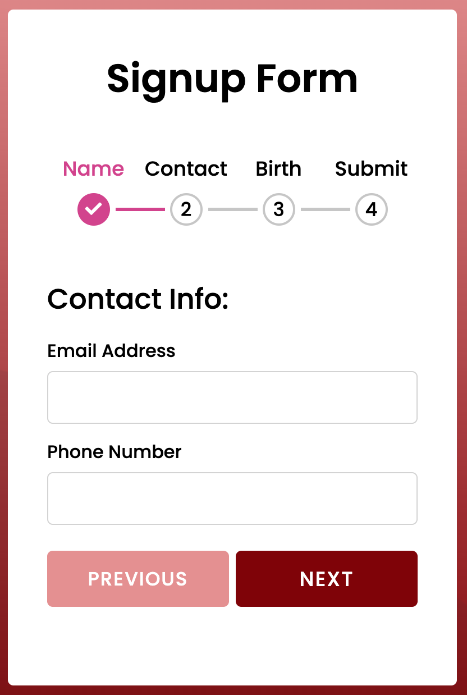
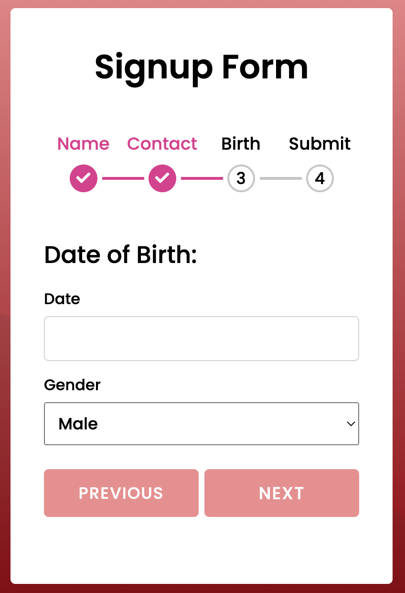
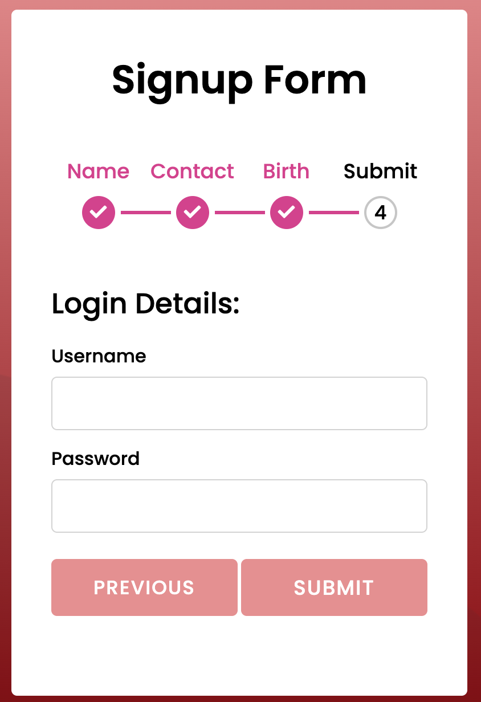

Don't forget to hit the :star: if you like this repo.

# Lab 13: Multi step form wizard

A multi-step form is a long form that is broken into multiple pieces. They’re used to make long forms, such as shipping or registration forms, less intimidating and daunting. By allowing customers and leads to complete their information in smaller chunks, you create a positive user experience and increase conversions.

By splitting up long forms into multiple steps, you will make your life easier when reviewing the form entries. You will also simplify things for the people completing your form. Forms that require a lot of information, such as registration forms or order forms, almost always benefit from being split up into multiple steps. For example, check out registration form. The sections in their form range from questions about appointment times to billing information. The form separates each category of questions into segmented steps, making the form easy-to-follow.

This form is lengthy and divided into four steps (see Figure 13.1). Name, Contact, Birth, and Submit are the steps. There is information that the user must enter at each step. Furthermore, there is a step progress bar at the top of the Form that indicates the number of steps. On each step, there are two buttons (Next and Previous). When you click the next button, you will be taken to the next step, and when you click the previous button, you will be taken back to the previous step.

> File 📁 : [lab13.zip](./download/lab13.zip?raw=true)
> 
> Activity 🏆 :
> You are required to generate a script.js file that allows the Next button to be active when clicked. Once the Next button is clicked, information related to the Contact will be displayed. Information related to a step progress bar for Name will be pink (refer Figure 13.2). Please complete the same process until step 4 which is Submit (Figure 13.3 and Figure 13.4).
> 

**Figure 13.1**: Mainpage - name

**Figure 13.2**: Contact

**Figure 13.3**: Birth

**Figure 13.4**: Submit

## Contribution 🛠️
Please create an [Issue](https://github.com/drshahizan/learn-php/issues) for any improvements, suggestions or errors in the content.

You can also contact me using [Linkedin](https://www.linkedin.com/in/drshahizan/) for any other queries or feedback.

