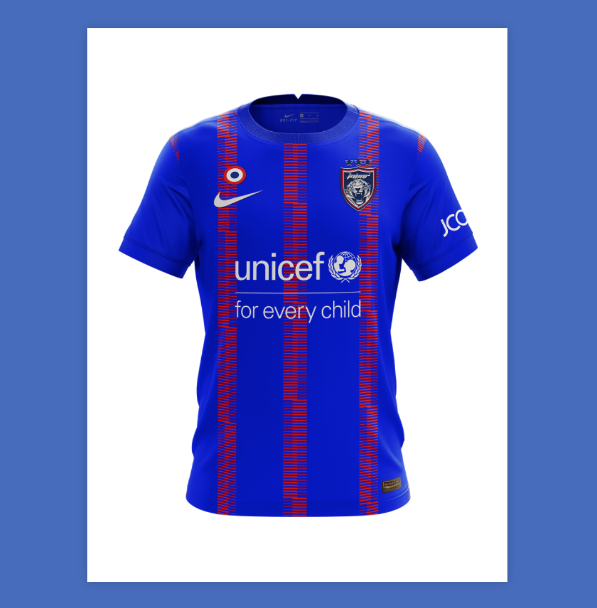
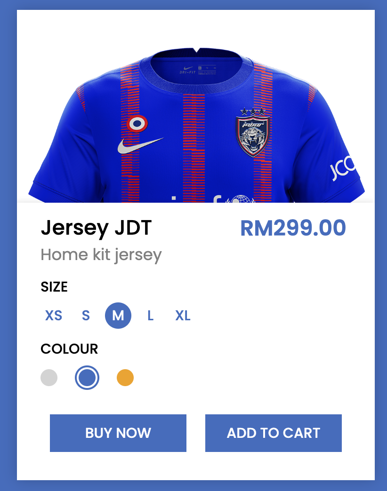
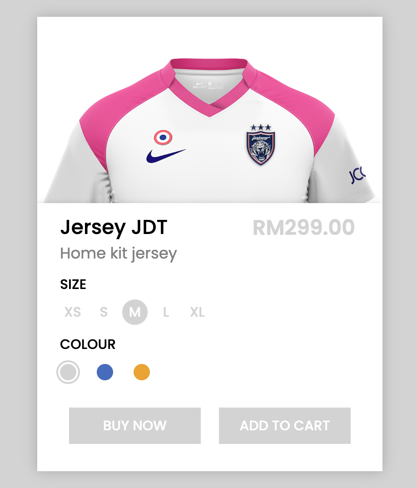
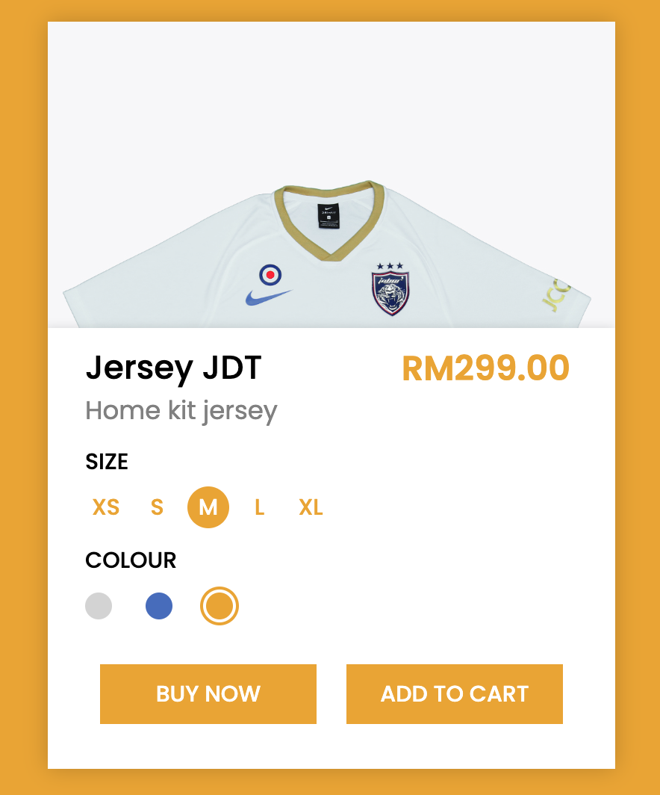

Don't forget to hit the :star: if you like this repo.

# Lab 2: JDT Jersey Product Card

A product card is used to display a picture of an item that is related to other items, such as products we sell. Jersey JDT was the case study used in this exercise. It enables users to quickly identify a specific item of interest to them from a group, such as search results.

In this lab exercise, the webpage initially contains only a product image (Figure 2.1), but when you hover over that image, the options/customize container for that product appears with a sliding animation (Figure 2.2). The product customise container contains a product name, size numbers, price value, colour options, and buttons. This product has only three colour options, and when you click on one of them, the product image, background colour, and colour of the customise container change to match your selection.

> File 📁 : [lab2.zip](./download/lab2.zip?raw=true)
> 
> Activity 🏆 :  
> You are asked to write JavaScript that will display another jersey after you click the colour radio button. You only need to add the <script> tag to the HTML file. When you click the grey radio button, the colours in the background, button, size, and price become grey. A white-pink jersey will also be displayed (Figure 2.3). Please see Figure 2.4 for the implementation results after clicking on the Gold radio button.

**Figure 2.1**: Main page

**Figure 2.2**: Hover your mouse over the image section

**Figure 2.3**: You select the grey radio option

**Figure 2.4**: You select the gold radio option

## Contribution 🛠️
Please create an [Issue](https://github.com/drshahizan/learn-php/issues) for any improvements, suggestions or errors in the content.

You can also contact me using [Linkedin](https://www.linkedin.com/in/drshahizan/) for any other queries or feedback.

