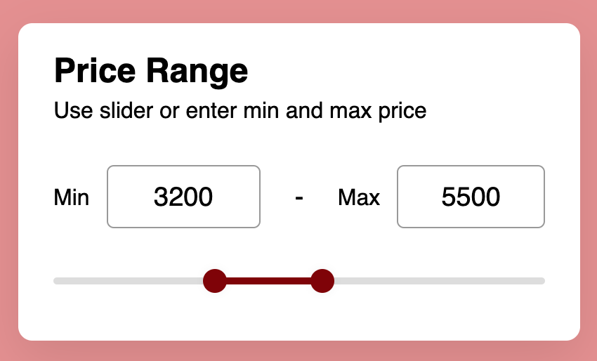

Don't forget to hit the :star: if you like this repo.

# Lab 4: Range Slider

Range sliders are used on web pages to allow the user to specify a numeric value that should not be less than a certain value and not greater than another given value. That is, it allows you to choose a value from a range represented as a slider.

Sliders allow users to view and select a value (or range) in the range along a bar. They are ideal for adjusting settings such as volume and brightness or for applying image filters.

Sliders can use icons at either end of the bar to represent a numeric or relative scale. The range of values or the nature of the values, such as the change in volume, can be communicated via icons. Sliders should not be used to adjust parameters with a delay in providing feedback to the user.

### Important points:
- Range sliders have a technical advantage over the input field as it will require less validation to be sure. For the same reason, it can benefit the user because a range slider will not generate an unnecessary error due to an “incorrect” entry.
- They are, however, somewhat limited as they cannot allow an infinite range of numbers, which makes them impractical, for example a phone number or a date.
- Range sliders work great when you have a strictly defined range that can only have a small number of values. For example, guest meal reservations or maybe a volume control.

The Range Slider is a very intuitive user interface with one or two handles to allow the user to choose a value within a limited range. The user drags a handle along a dimension to set a value. A typical slider is usually found in the color picker where we can drag the arrow left and right to select the correct RGB value.

> File 📁 : [lab4.zip](./download/lab4.zip?raw=true)
> 
> Activity 🏆 : 
> You must create javascript for a price range with a value between 0 (minimum) and 10000. (max). The user can enter data in the provided field, which will automatically change the range of the slider. Furthermore, users can drag along the available price range line.
> 

**Figure 4.1**: Price range

## Contribution 🛠️
Please create an [Issue](https://github.com/drshahizan/learn-php/issues) for any improvements, suggestions or errors in the content.

You can also contact me using [Linkedin](https://www.linkedin.com/in/drshahizan/) for any other queries or feedback.

