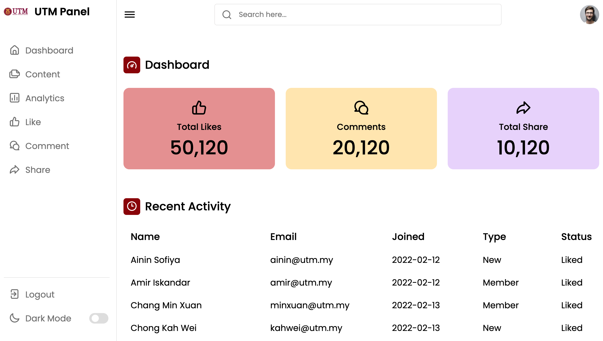
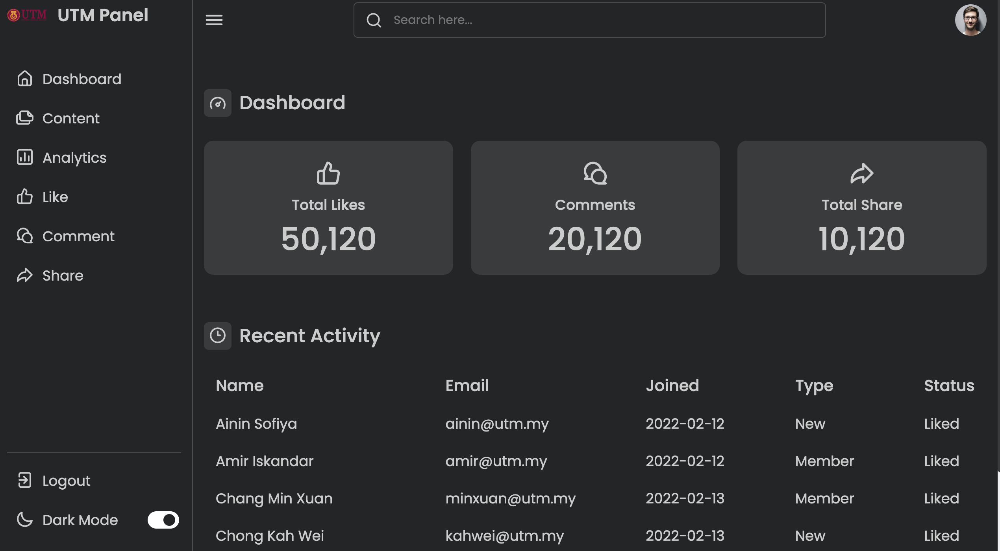
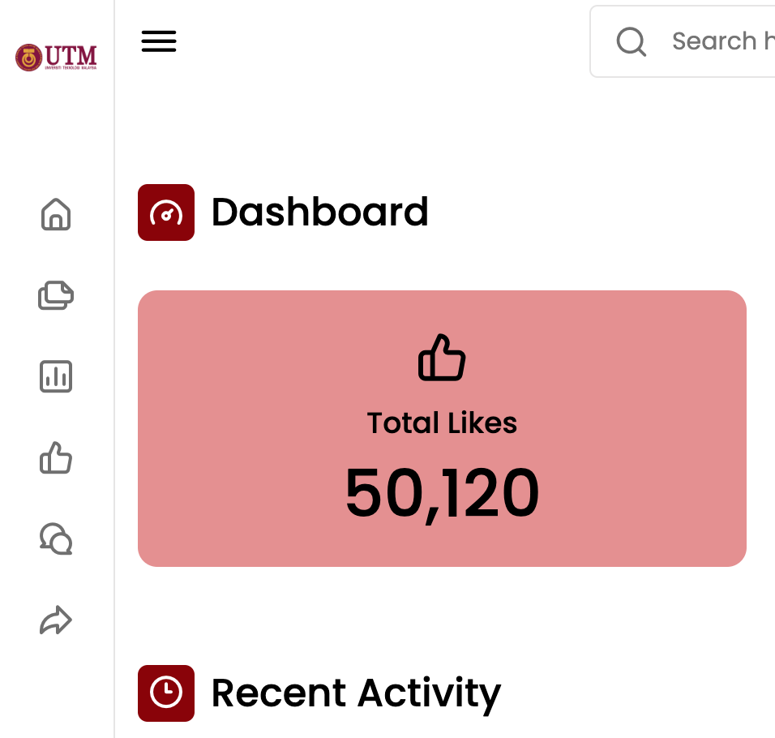

Don't forget to hit the :star: if you like this repo.

# Lab 5: Admin Dashboard Panel

Admin Dashboard is a header section of the website where the admin can see the overall performance of website. Admin dashboard panel helps to make quick decisions for admin to make decisions of what should they improve in his website or business.

The information that needs to be in the admin panel dashboard is as follows: 
- Overall details of the website
- Quick Navigation Links
- Search box
- Responsive Feature
- Login and Logout Feature
- Fully Controllable

> File 📁 : [lab5.zip](./download/lab5.zip?raw=true)
> 
> Activity 🏆 : 
> For the JavaScript code used in this lab exercise, you must create a script.js file. A sidebar on the right side of the interface contains the logo image, name, and some navigation links (Figure 17.1). Furthermore, at the left - bottom, there is a fascinating section "Dark Mode" with a toggle button (Figure 17.2). When you click on that toggle button, the interface of this admin panel changes to dark mode. On the left side, there is a sidebar toggle button that allows you to open or close that sidebar (Figure 17.3). Also included are a search box and data summaries.
> 

**Figure 5.1**: Admin dashboard

**Figure 5.2**: Admin dashboard - dark mode

**Figure 5.3**: Close sidebar

## Contribution 🛠️
Please create an [Issue](https://github.com/drshahizan/learn-php/issues) for any improvements, suggestions or errors in the content.

You can also contact me using [Linkedin](https://www.linkedin.com/in/drshahizan/) for any other queries or feedback.

