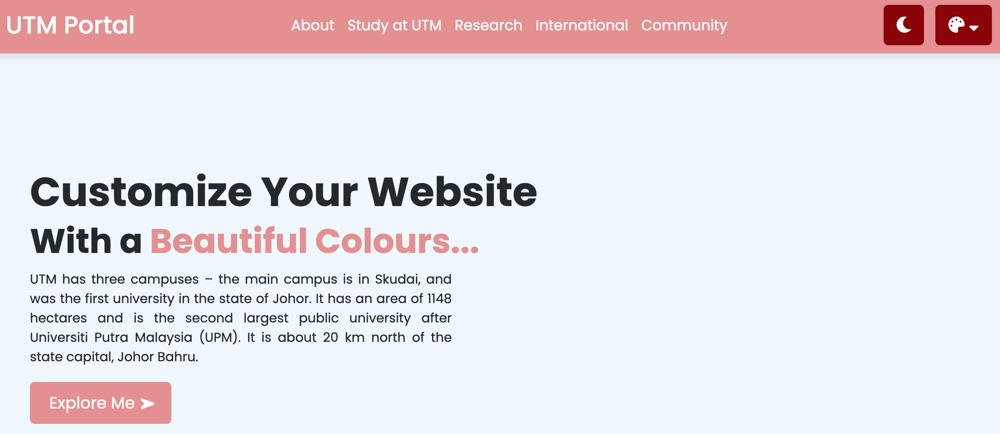
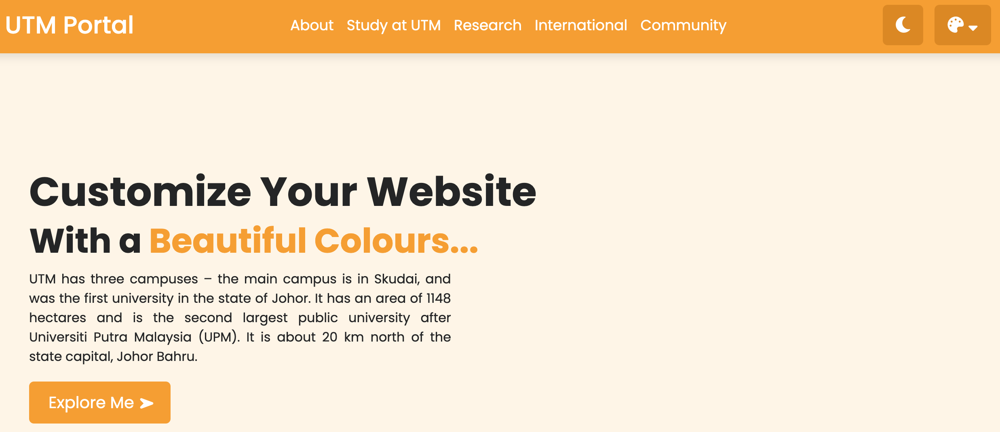
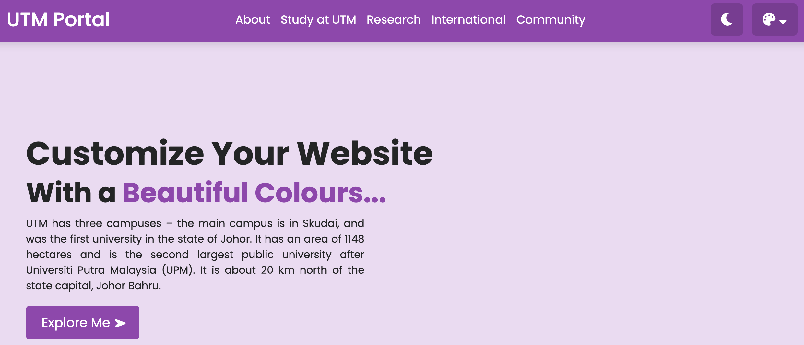
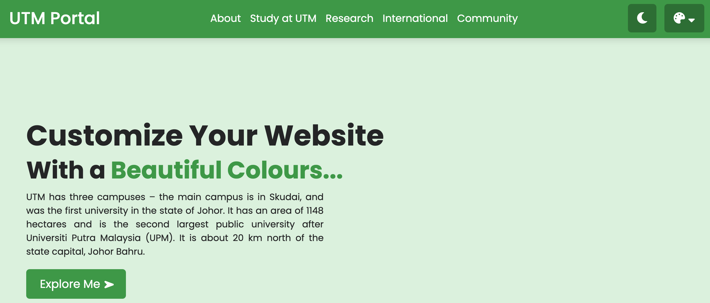
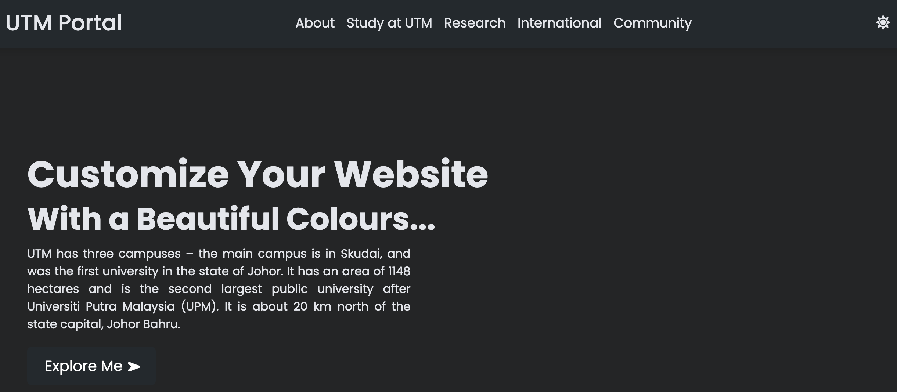

Don't forget to hit the :star: if you like this repo.

# Lab 6: Custom Color Theme Website

Colors are the first thing people notice when they visit your site, and your color scheme can make a huge impact on both style and consistency. You will perform an exercise in which you will change the colour theme of the website.

> File 📁 : [lab6.zip](./download/lab6.zip?raw=true)
> 
> Activity 🏆 : 
> In this lab exercise, you must complete two tasks using JavaScript:
> - customise the colour theme for the website
> - create a website with a day-night mode (dark/light theme).
> 

Take a look at the image of our website design provided (see Figure 6.1). On the top, there's a navigation menu bar, a ホーム section with some text, and a lovely button. We can see an icon to switch the website into dark and light mode on the right side of the navigation menu bar, and a colour switcher button on the right end side, from it we can switch any colour we want.

The entire UI design of this website is made up of HTML and CSS code, with some JavaScript code used to make the website dark and light mode (day-night mode) and to switch the website colour theme.

**Figure 6.1**: Maroon colour

At first, we have seen a navigation bar on the top with some text and a button. When I clicked on the website's theme color switcher one color switcher box appear and some color, and also we have seen which color was active. When I clicked on the second orange color, all the theme colors of the website changed into orange and like this, I switched the website to a different color (refer Figure 6.2 - 6.4).

**Figure 6.2**: Orange colour

**Figure 6.3**: Purple colour

**Figure 6.4**: Green colour

When I clicked on the moon button, the website went into dark mode and sun icons appeared; when I clicked on the sun icons again, the website went back into light mode (Figure 6.5).

**Figure 6.5**: Dark mode

## Contribution 🛠️
Please create an [Issue](https://github.com/drshahizan/learn-php/issues) for any improvements, suggestions or errors in the content.

You can also contact me using [Linkedin](https://www.linkedin.com/in/drshahizan/) for any other queries or feedback.

