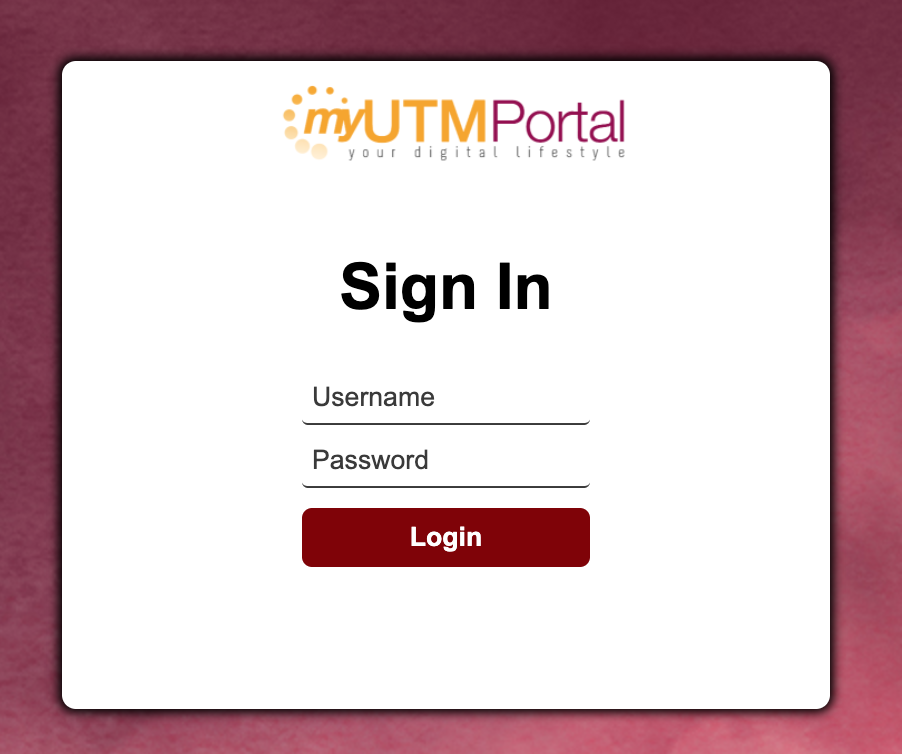
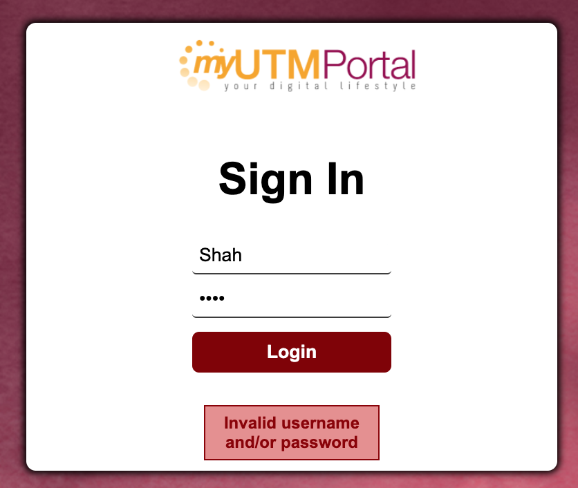
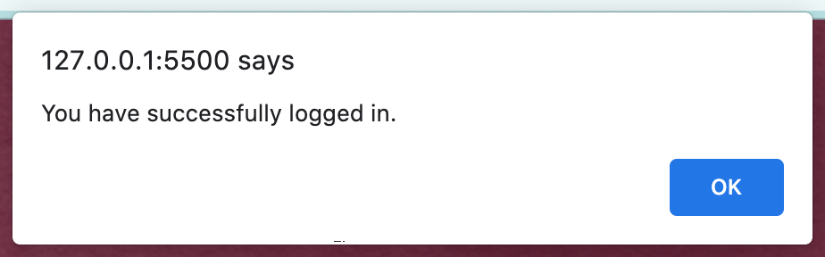

Don't forget to hit the :star: if you like this repo.

# Lab 7: Login

A login is a set of credentials used to authenticate a user. Most often, these consist of a username and password. Logins are used by websites, computer applications, and mobile apps. They are a security measure designed to prevent unauthorized access to confidential data. When a login fails (i.e, the username and password combination does not match a user account), the user is disallowed access. Many systems block users from even trying to log in after multiple failed login attempts.

At a basic level, logins make user accounts possible. Most systems require unique usernames, which ensures every user's login is different. On a more advanced level, logins provide a security layer between unsecured and secure activity. Once a user logs in to a secure website, for example, all data transfers are typically encrypted. This prevents other systems from viewing or recording the data transferred from the server.

> File 📁 : [lab7.zip](./download/lab7.zip?raw=true)
> 
> Activity 🏆 : 
>You are required to generate a file named login.js for the JavaScript code used in this lab exercise. In the input field provided, the user will enter their username and password. The user will then click the Login button to Sign In (see Figure 7.1). Please use the username "user" and password "abc" as a default data. If the value is incorrect (check with default data), display the message "Invalid user name and/or password" (see Figure 7.2). If the input is correct, display the message "You have successfully logged in" in a pop-up window (see Figure 7.3).
> 

**Figure 7.1**: Login Page

**Figure 7.2**: Invalid username and/or password

**Figure 7.3**: Login successful

## Contribution 🛠️
Please create an [Issue](https://github.com/drshahizan/learn-php/issues) for any improvements, suggestions or errors in the content.

You can also contact me using [Linkedin](https://www.linkedin.com/in/drshahizan/) for any other queries or feedback.

