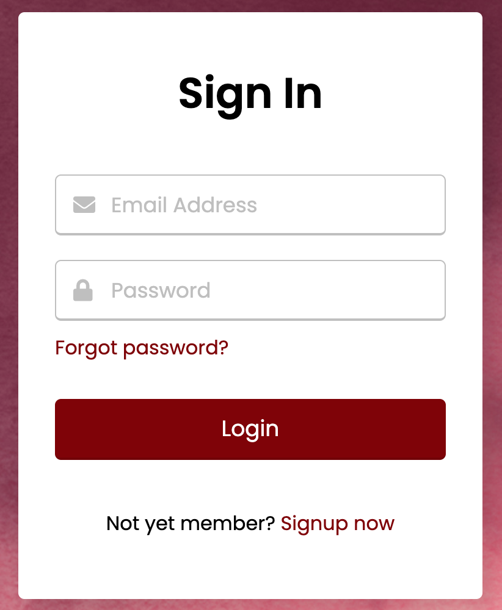

Don't forget to hit the :star: if you like this repo.

# Lab 8: Login Form Validation

In HTML, form validation means determining whether the user's entered credential – Email, Username, Password – is valid and correct. The user will not be able to access the restricted page until he or she enters a valid email address and password. When a user clicks the login button without first entering their email address and password, an error message appears informing them that these fields cannot be left blank.

> File 📁 : [lab8.zip](./download/lab8.zip?raw=true)
> 
> Activity 🏆 : 
> You are required to provide javascript to login.This exercise includes a login form with login text, two input fields, and a login button. Those login errors are not displayed at first, but they appear when the user clicks on the login button without entering their email address or password. These errors will be hidden once the user begins entering their credentials into the input fields.
> 

**Figure 8.1**: Login

**Figure 8.2**: Error message

## Contribution 🛠️
Please create an [Issue](https://github.com/drshahizan/learn-php/issues) for any improvements, suggestions or errors in the content.

You can also contact me using [Linkedin](https://www.linkedin.com/in/drshahizan/) for any other queries or feedback.

