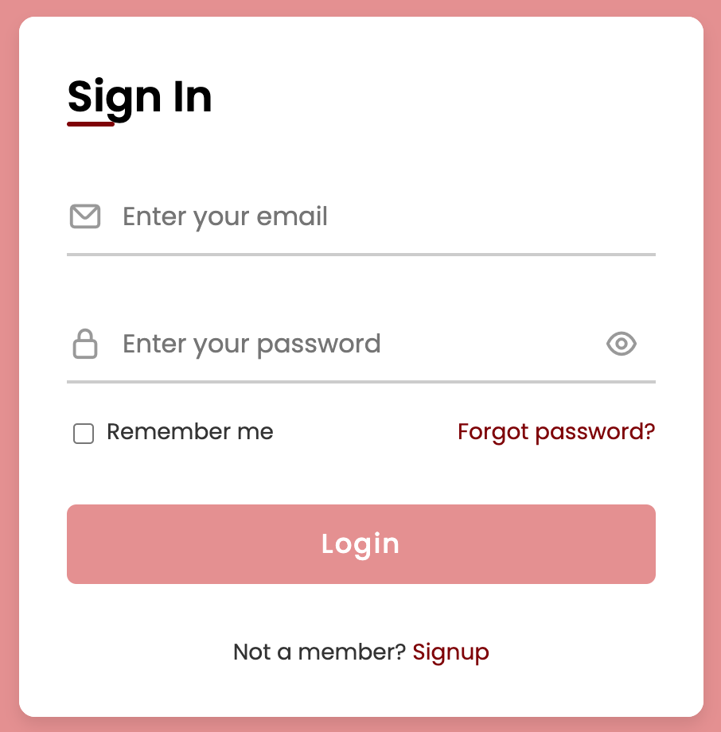
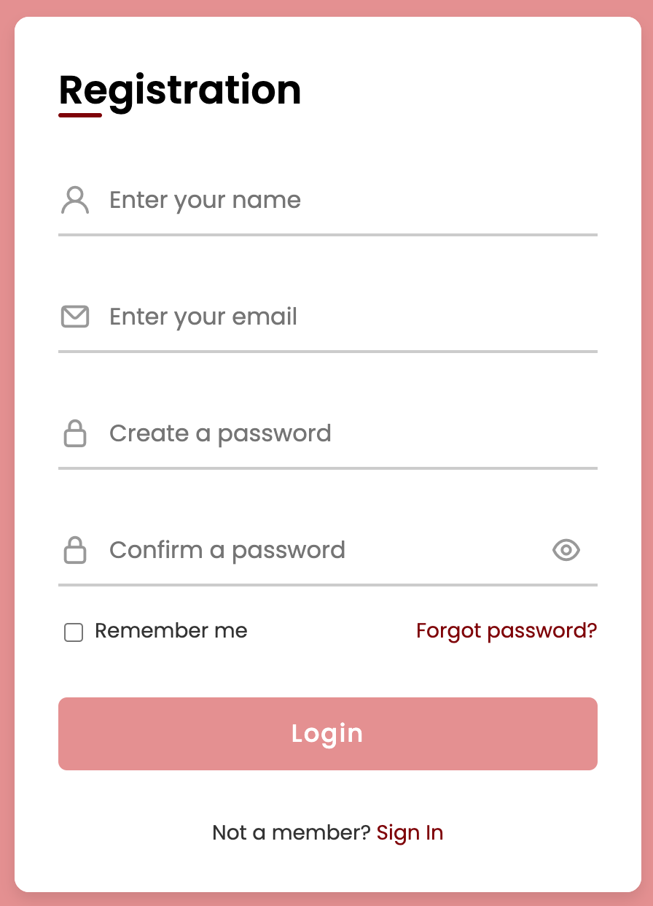
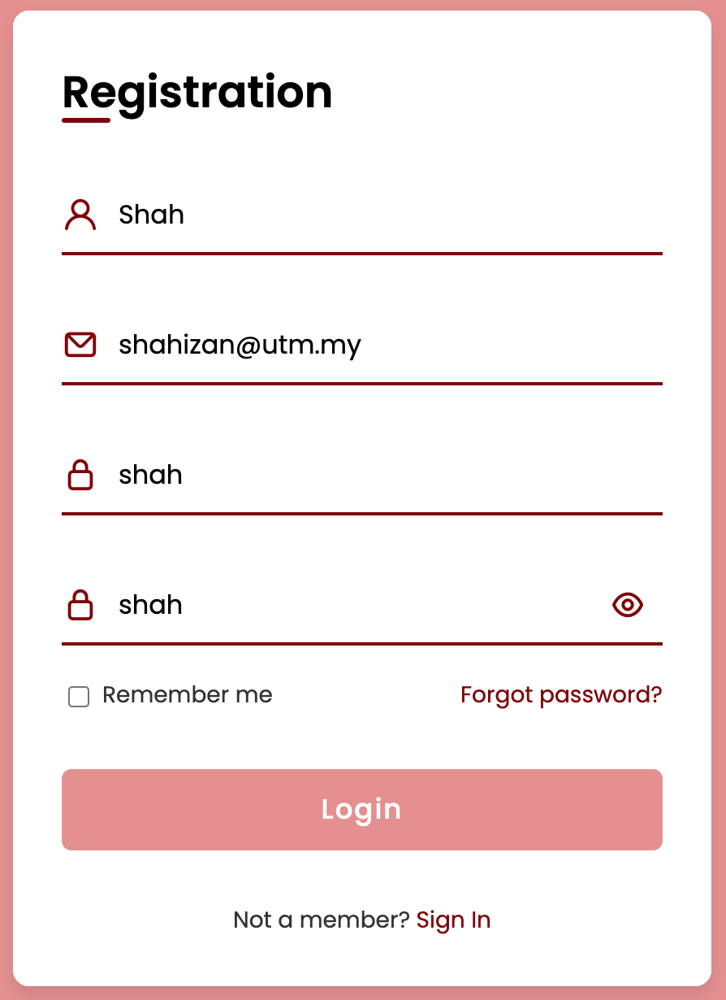

Don't forget to hit the :star: if you like this repo.

# Lab 9: Form for Login and Registration

> File 📁 : [lab9.zip](./download/lab9.zip?raw=true)
> 
> Activity 🏆 :
> You will learn how to create a form with two parts: login and registration. The login form is the section of the website where users enter their information in order to access the website. Same as the Registration form is the section with the combination of input fields where users need to fill in details to create a login id and password. The login form will appear first, and when we click the signup now button, the login form will be replaced by the registration form.
> 

Figure 9.1 shows a login form with a login title, some input fields with beautiful focus animation, a button, text, links, a password hide and show eye toggle button, and a password hide and show eye toggle button. When you clicked on the signup link, a registration form with a beautiful sliding animation will appeared.

**Figure 9.1**: Sign In

You will see information such as a title, an input field, a button, and some text with navigation links on the registration form. The registration form disappears when you click the SignIn link, and the login form appears.

**Figure 9.2**: Registration

To see the words you typed in the password input, click show eye toggle button (see Figure 9.3).

**Figure 9.3**: Sample data

## Contribution 🛠️
Please create an [Issue](https://github.com/drshahizan/learn-php/issues) for any improvements, suggestions or errors in the content.

You can also contact me using [Linkedin](https://www.linkedin.com/in/drshahizan/) for any other queries or feedback.

