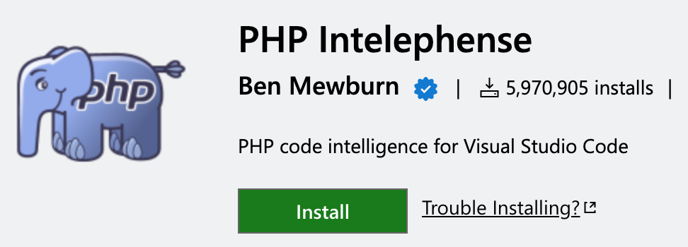
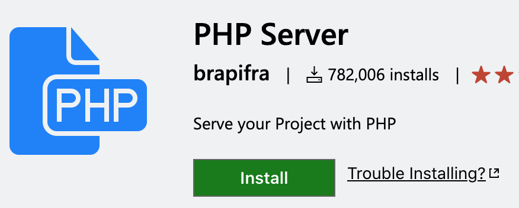

Don't forget to hit the :star: if you like this repo.

# Lab 2: PHP Intelephense and PHP Server

PHP Intelephense and PHP Server are two popular extensions for Visual Studio Code that enhance the PHP development experience.

## PHP Intelephense
Intelephense is a high performance PHP language server packed full of essential features for productive PHP development. PHP Intelephense is an advanced PHP language server that offers intelligent code completion, code navigation, and syntax highlighting. It also provides features like parameter suggestions, documentation pop-ups, and code formatting. PHP Intelephense makes coding in PHP easier, faster, and more efficient.
- Fast camel/underscore case code completion (IntelliSense) for document, workspace and built-in symbols and keywords with automatic addition of use declarations.
- Detailed signature (parameter) help for document, workspace and built-in constructors, methods, and functions.
- Rapid workspace wide go to definition support. Workspace wide find all references.
- Fast camel/underscore case workspace symbol search. Full document symbol search that also powers breadcrumbs and outline UI.
- Multiple diagnostics for open files via an error tolerant parser and powerful static analysis engine. Lossless PSR-12 compatible document/range formatting.
- Formats combined HTML/PHP/JS/CSS files too.
- Embedded HTML/JS/CSS code intelligence.
- Detailed hover with links to official PHP documentation.
- Smart highlight of references and keywords. Reads PHPStorm metadata for improved type analysis and suggestions.

## PHP Server: 
is a simple extension that allows you to run a PHP server within Visual Studio Code. It saves developers the hassle of setting up and configuring a separate web server to test their PHP applications. With PHP Server, you can launch a web server with just a few clicks, specify a root folder, and then test your PHP code within the editor.

Here are the step-by-step instructions to add PHP Intelephense and PHP Server extensions in Visual Studio Code:

1. Open Visual Studio Code on your computer.
2. Click on the "Extensions" icon in the left-hand sidebar (or press Ctrl+Shift+X on Windows, or Cmd+Shift+X on Mac) to open the Extensions panel.
3. In the search bar at the top of the Extensions panel, type "PHP Intelephense" and press Enter.
4. From the search results, click on the "Install" button next to the "PHP Intelephense" extension.

    

5. Wait for the installation process to complete, and then click the "Reload" button to restart Visual Studio Code and activate the extension.
6. Repeat steps 3-5 to install the "PHP Server" extension.

    

7. Once both extensions are installed and activated, open a PHP file in Visual Studio Code.
8. In the bottom right corner of the editor window, you should see the current language mode displayed. Click on it to open the language mode selection menu.
9. In the language mode selection menu, select "PHP" to activate the PHP language mode.
10. If you have not already done so, create a PHP server using the "PHP Server" extension. To do this, open the Command Palette (Ctrl+Shift+P on Windows, or Cmd+Shift+P on Mac) and type "PHP Server: Serve Project" in the search bar. Select this command to start a new server and serve your project.

    

11. To stop the server, the `PHP Server: Stop project` command can be executed likewise.
12. You should now be able to use PHP Intelephense to get code completion, syntax highlighting, and other advanced features for your PHP code. The PHP Server extension allows you to run and test your PHP code directly from within Visual Studio Code.

## Contribution 🛠️
Please create an [Issue](https://github.com/drshahizan/learn-php/issues) for any improvements, suggestions or errors in the content.

You can also contact me using [Linkedin](https://www.linkedin.com/in/drshahizan/) for any other queries or feedback.

