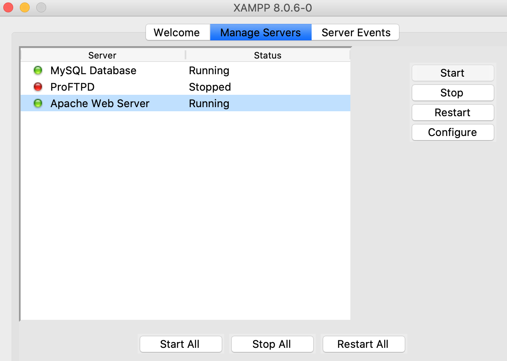
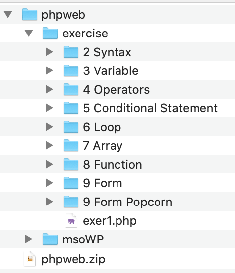
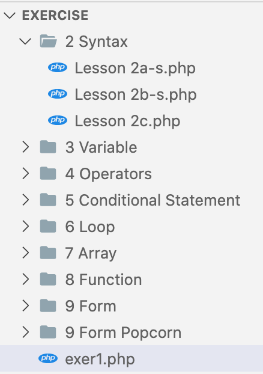
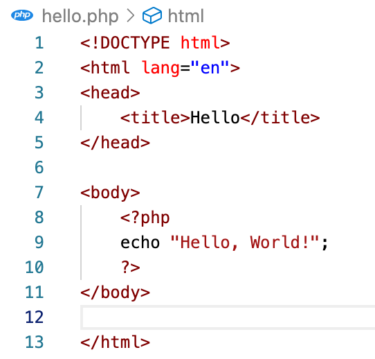
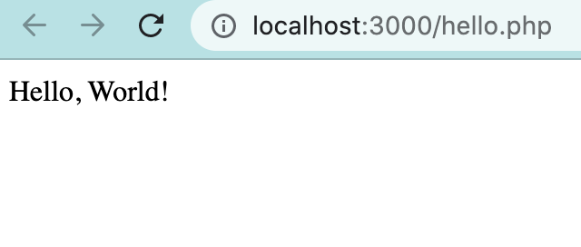
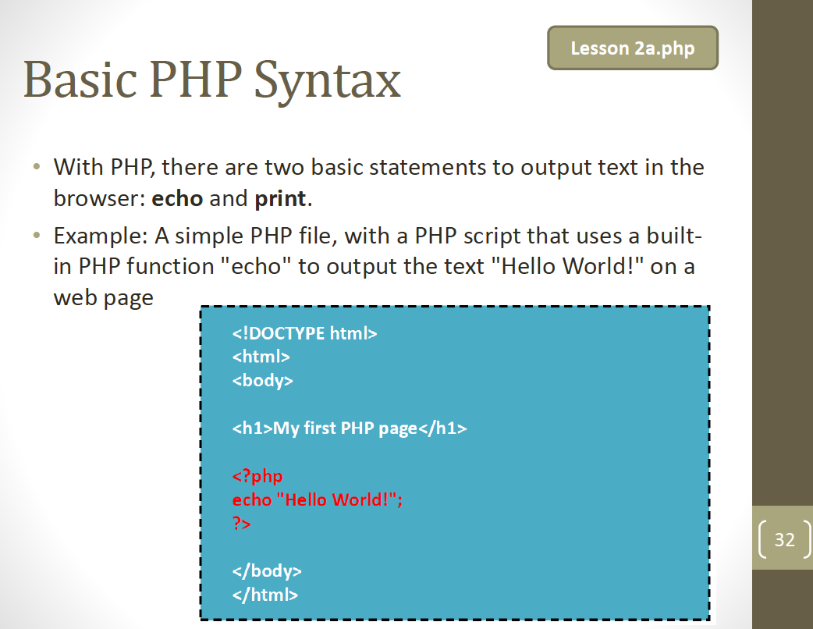
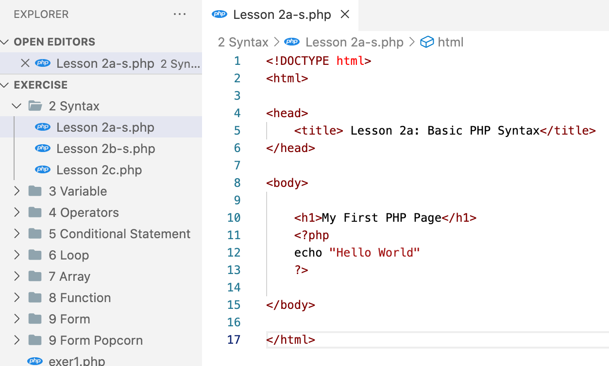

<a href="https://github.com/drshahizan/learn-php/stargazers"></a>
<a href="https://github.com/drshahizan/learn-php/network/members"></a>
<a href="https://github.com/drshahizan/learn-php/pulls"></a>
<a href="https://github.com/drshahizan/learn-php/issues"></a>
<a href="https://github.com/drshahizan/learn-php/graphs/contributors"></a>


Don't forget to hit the :star: if you like this repo.

# Lab 3: How to run PHP on Visual Studio Code

## Download the file phpweb.zip

This lab exercise will introduce you to PHP files. Make sure you have XAMPP installed. You must have Apache Web Server running in order for PHP code to be processed. Please ensure that your XAMPP is configured as follows.



**Figure 1.1**: PHP

Please download the [phpweb.zip](download/phpweb.zip) PHP source code file. When you unzip this file, you will see two folders: `exercise` and `msoWP`. This file should be placed in the `XAMPP/htdocs` folder. You will be using the `exercise` folder (Figure 1.2) in this exercise lab.



**Figure 1.2**: Exercise folder

Please open the `exercise` folder in Visual Studio Code. The following are the outcomes of the implementation (Figure 1.3).



**Figure 1.3**: File exercise opens in Visual Studio Code


## Hello World in PHP

To create a `hello.php` file, follow these steps:
1. Create a new file called `hello.php`.
2. In the `<body>` section, add the following code:

```php
<?php
   echo "Hello, World!";
?>
```

Refer to Figure 1.4 for an example of what the `hello.php` file should look like.



**Figure 1.4**: hello.php

Let’s break down the different components of the code. All PHP code falls within a PHP Code Block, starting with `<?php` and ending with `?>`. `echo` is a language construct. Its arguments are a list of expressions following the `echo` keyword, separated by commas and not delimited by parentheses. `echo` tells PHP to display or output whatever is included between `echo` and the ending semicolon `;`. Between the `echo` and the `;` is a sequence of characters — `Hello, World!` — that is enclosed in quotation marks. Any characters that are inside quotation marks are called a string.

## Running the “Hello, World!” Program

To run the code, right-click and then choose `PHP Server: Project Service`. The results of the implementation are shown in Figure 1.5.


**Figure 1.5: PHP Serve**



**Figure 1.6**: Output

Let’s go over what the program did in more detail. PHP executed the line `echo "Hello, World!";` by calling the language construct `echo`. The string value of `Hello, World!` was passed to the construct. In this example, the string `Hello, World!` is also called an argument since it is a value that is passed to another part of the code, such as a construct or a function. The quotes that are on either side of `Hello, World!` were not output to the screen because they are used to tell PHP that this section of code contains a string. The quotation marks delineate where the string begins and ends.

## Download the file PHP-mso.pdf

[PHP mso.pdf](download/PHP-mso.pdf) contains descriptions related to PHP. Please read each item one by one. This slide also includes a lab exercise, such as Lesson 2a.php. Please see page 32 for more information. The code is available in VSC in the Syntax 2 folder (Figure 1.7).



**Figure 1.7**: PHP Slide



**Figure 1.8**: Code

Please examine the code and comprehend how it is implemented. After that, execute the code. Run all of the code in the slide.

## Contribution 🛠️
Please create an [Issue](https://github.com/drshahizan/learn-php/issues) for any improvements, suggestions or errors in the content.

You can also contact me using [Linkedin](https://www.linkedin.com/in/drshahizan/) for any other queries or feedback.


